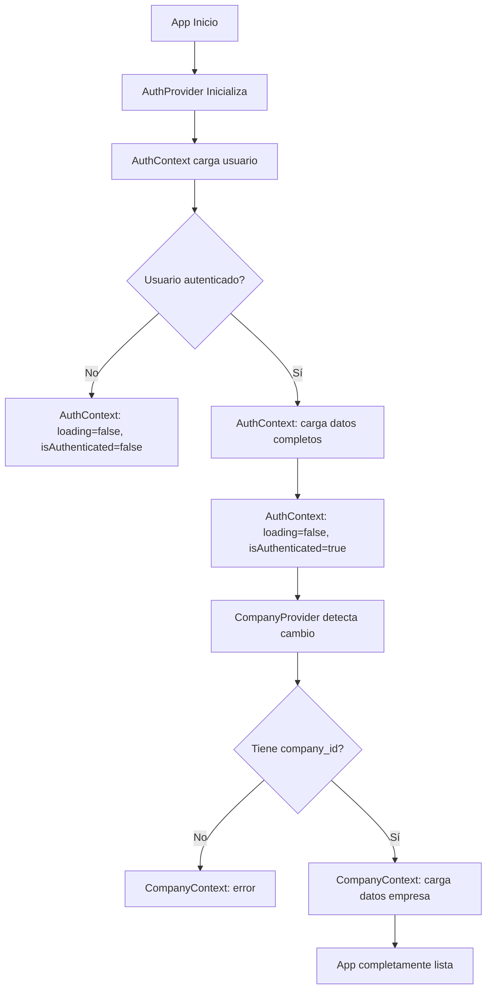

# 📚 Documentación Completa: AuthContext y CompanyContext

## 🎯 Índice

1. [**AuthContext - Sistema de Autenticación**](#authcontext---sistema-de-autenticación)
2. [**CompanyContext - Gestión de Empresa**](#companycontext---gestión-de-empresa)
3. [**Interacción entre Contextos**](#interacción-entre-contextos)
4. [**Flujos de Uso**](#flujos-de-uso)

---

## 🔐 AuthContext - Sistema de Autenticación

### **🏗️ Arquitectura General**

El `AuthContext` implementa un sistema dual simplificado que combina:

- **Supabase nativo**: Para tokens y autenticación
- **Edge Functions**: Para datos de usuario de la base de datos
- **Estado único de loading**: No se marca como listo hasta tener TODO

### **📊 Estados Principales**

```javascript
{
  user: null,              // Usuario completo desde tabla users
  session: null,           // Sesión de Supabase (tokens)
  isAuthenticated: false,  // Si está autenticado
  loading: true,           // Loading general hasta que TODO esté listo
  initializationState: {}  // Estado de inicialización para CompanyContext
}
```

---

## 🔧 Funciones del AuthContext

### **1️⃣ `initSupabase()` - Inicializador de Cliente**

```javascript
const initSupabase = async () => {
  if (!supabase) {
    const supabaseModule = await import("../config/supabase");
    supabase = supabaseModule.default;
  }
  return supabase;
};
```

**🎯 Propósito**: Lazy loading del cliente Supabase

- ✅ **Evita imports circulares**
- ✅ **Optimiza performance** (carga solo cuando necesario)
- ✅ **Singleton pattern** (una sola instancia)

---

### **2️⃣ `login({ email, contrasena })` - Autenticación de Usuario**

**🔍 Flujo Completo:**

#### **Fase 1: Preparación**

```javascript
setLoading(true);
const loginData = { email: email.trim(), contrasena };
```

#### **Fase 2: Estrategia XMLHttpRequest (Principal)**

```javascript
// 🛡️ STRATEGY 1: XMLHttpRequest con apikey como query param
const url = `${SUPABASE_URL}/functions/v1/login/auth/login?apikey=${ANON_KEY}`;
xhr.open("POST", url);
xhr.setRequestHeader("Content-Type", "application/json");
```

**🎯 Por qué XMLHttpRequest:**

- ✅ **Bypass CORS preflight** (evita headers personalizados)
- ✅ **Bypass antivirus** (algunos bloquean fetch)
- ✅ **Mayor compatibilidad** con proxies corporativos

#### **Fase 3: Fallback Fetch (Secundario)**

```javascript
// 🛡️ STRATEGY 2: Fallback a fetch normal
response = await fetch(`${SUPABASE_URL}/functions/v1/register`, {
  method: "POST",
  headers: {
    "Content-Type": "application/json",
    apikey: SUPABASE_ANON_KEY,
  },
  body: JSON.stringify(registrationData),
});
```

#### **Fase 4: Procesamiento de Respuesta**

```javascript
if (responseData.success && responseData.session) {
  // Guardar datos temporales para cargar usuario completo
  tempUserDataFromLogin = {
    session: responseData.session,
    user: responseData.user,
    timestamp: Date.now(),
  };

  // Establecer sesión en Supabase
  await sb.auth.setSession({
    access_token: responseData.session.access_token,
    refresh_token: responseData.session.refresh_token,
  });
}
```

#### **Fase 5: Debug y Logging**

```javascript
// 🔍 GUARDAR LOGS EN LOCALSTORAGE PARA DEBUG
const debugLogs = [];
await AsyncStorage.setItem("auth_debug_logs", JSON.stringify(debugLogs));
```

---

### **3️⃣ `register({ email, contrasena, nombre, mode })` - Registro de Usuario**

**🔍 Flujo Completo:**

#### **Validaciones Iniciales**

```javascript
if (!email || !contrasena || !nombre) {
  throw new Error("Email, contraseña y nombre son obligatorios");
}

if (contrasena.length < 6) {
  throw new Error("La contraseña debe tener al menos 6 caracteres");
}
```

#### **Estrategia Dual (igual que login)**

1. **XMLHttpRequest** (principal)
2. **Fetch** (fallback)

#### **Datos de Registro**

```javascript
const registrationData = {
  email: email.trim(),
  contrasena,
  nombre: nombre.trim(),
  mode: mode || "create", // "create" o "join"
};
```

---

### **4️⃣ `logout()` - Cierre de Sesión**

```javascript
const logout = async () => {
  try {
    console.log("👋 Logging out...");

    const sb = await initSupabase();
    await sb.auth.signOut();

    // El onAuthStateChange se encarga de limpiar el estado
  } catch (error) {
    console.error("❌ Logout error:", error);
    await clearAuthState(); // Limpieza manual en caso de error
  }
};
```

**🎯 Características:**

- ✅ **Limpieza automática** vía `onAuthStateChange`
- ✅ **Fallback manual** en caso de error
- ✅ **Limpieza completa** de estado y storage

---

### **5️⃣ `updateProfile(profileData)` - Actualización de Perfil**

```javascript
const updateProfile = async (profileData) => {
  try {
    if (!session?.access_token) {
      throw new Error("No session available");
    }

    const response = await fetch(
      `${SUPABASE_URL}/functions/v1/users/${user.id}`,
      {
        method: "PUT",
        headers: {
          Authorization: `Bearer ${session.access_token}`,
          "Content-Type": "application/json",
          apikey: SUPABASE_ANON_KEY,
        },
        body: JSON.stringify(profileData),
      }
    );

    const data = await response.json();

    if (data.success && data.user) {
      setUser(data.user);
      return { success: true, user: data.user };
    }
  } catch (error) {
    return { success: false, error: error.message };
  }
};
```

---

### **6️⃣ `ensureTokenAvailable()` - Gestión de Tokens**

**🔍 Funcionalidades:**

#### **Verificación de Token**

```javascript
if (!session?.access_token) {
  throw new Error("No session available");
}
```

#### **Verificación de Expiración**

```javascript
const now = Math.floor(Date.now() / 1000);
const expiresAt = session.expires_at;
const timeUntilExpiry = expiresAt - now;

if (timeUntilExpiry < 300) {
  // Menos de 5 minutos
  // Refresh token
}
```

#### **Refresh Automático**

```javascript
const {
  data: { session: refreshedSession },
  error,
} = await sb.auth.refreshSession();

if (refreshedSession) {
  setSession(refreshedSession);
  await AsyncStorage.setItem("auth_token", refreshedSession.access_token);
  return refreshedSession.access_token;
}
```

---

### **7️⃣ `clearAuthState()` - Limpieza de Estado**

```javascript
const clearAuthState = async () => {
  setUser(null);
  setSession(null);
  setIsAuthenticated(false);
  setLoading(false);

  // Limpiar storage
  try {
    await AsyncStorage.multiRemove([
      "auth_token",
      "auth_refresh_token",
      "last_user_data",
    ]);
  } catch (error) {
    console.error("Error clearing storage:", error);
  }
};
```

---

### **8️⃣ `initializeAuth()` - Inicialización del Sistema**

**🔍 Flujo de Inicialización:**

#### **Fase 1: Obtener Cliente Supabase**

```javascript
const sb = await initSupabase();
```

#### **Fase 2: Verificar Sesión Existente**

```javascript
const {
  data: { session: currentSession },
} = await sb.auth.getSession();

if (currentSession && mounted) {
  console.log("🔍 Found existing session for:", currentSession.user.email);
}
```

#### **Fase 3: Verificar Refresh de Token**

```javascript
const now = Math.floor(Date.now() / 1000);
const expiresAt = currentSession.expires_at;
const timeUntilExpiry = expiresAt - now;

if (timeUntilExpiry < 3600) {
  // Menos de 1 hora
  // Refresh session automáticamente
}
```

#### **Fase 4: Cargar Usuario Completo**

```javascript
await loadCompleteUserData(currentSession.access_token);
```

#### **Fase 5: Configurar Listener**

```javascript
sb.auth.onAuthStateChange(async (event, session) => {
  if (event === "SIGNED_IN" && session) {
    await loadCompleteUserData(session.access_token);
  } else if (event === "SIGNED_OUT") {
    await clearAuthState();
  }
});
```

---

## 🏢 CompanyContext - Gestión de Empresa

### **🏗️ Arquitectura General**

El `CompanyContext` depende completamente del `AuthContext` y gestiona:

- **Datos de empresa**: Información, configuraciones, límites
- **Estadísticas de uso**: Usuarios, clientes, productos, storage
- **Límites del plan**: Validaciones de capacidad
- **Operaciones empresariales**: Configuración, invitaciones, planes

### **📊 Estados Principales**

```javascript
{
  company: null,    // Datos de la empresa actual
  settings: null,   // Configuraciones de la empresa
  usage: null,      // Estadísticas de uso actual
  loading: true,    // Estado de carga
  error: null       // Errores de empresa
}
```

---

## 🔧 Funciones del CompanyContext

### **1️⃣ `useEffect()` - Inicialización Dependiente**

```javascript
useEffect(() => {
  // ✅ DEPENDENCY GATES - Esperar a que AuthContext esté listo
  if (!auth.isAuthenticated) {
    console.log("🏢 User not authenticated, waiting...");
    setLoading(false);
    return;
  }

  if (!auth.user) {
    console.log("🏢 User object not ready, waiting...");
    return;
  }

  if (auth.loading) {
    console.log("🏢 AuthContext still loading, waiting...");
    return;
  }

  if (!auth.user.company_id) {
    console.log("🏢 User without company_id - showing error");
    setError("Usuario sin empresa asignada");
    setLoading(false);
    return;
  }

  // TODO está listo, cargar datos de empresa
  loadCompanyData();
}, [auth.isAuthenticated, auth.user, auth.loading]);
```

**🎯 Dependency Gates:**

- ✅ **Usuario autenticado** (`auth.isAuthenticated`)
- ✅ **Objeto user disponible** (`auth.user`)
- ✅ **AuthContext completamente cargado** (`!auth.loading`)
- ✅ **Company ID presente** (`auth.user.company_id`)

---

### **2️⃣ `loadCompanyData()` - Carga de Datos Empresariales**

```javascript
const loadCompanyData = async () => {
  try {
    setLoading(true);
    setError(null);

    const [companyResult, usageResult] = await Promise.allSettled([
      EdgeFunctions.companies.getById(auth.user.company_id),
      EdgeFunctions.companies.getUsageStats(auth.user.company_id),
    ]);

    if (companyResult.status === "fulfilled" && companyResult.value.success) {
      setCompany(companyResult.value.data);
    }

    if (usageResult.status === "fulfilled" && usageResult.value.success) {
      setUsage(usageResult.value.data);
    }
  } catch (error) {
    console.error("Error loading company data:", error);
    setError("Error cargando datos de empresa");
  } finally {
    setLoading(false);
  }
};
```

**🎯 Características:**

- ✅ **Carga paralela** con `Promise.allSettled`
- ✅ **Error handling robusto** (no falla si una promesa falla)
- ✅ **Estados específicos** para cada tipo de dato

---

### **3️⃣ `checkLimit(resource, amount)` - Validación de Límites**

```javascript
const checkLimit = async (resource, amount = 1) => {
  if (!company || !auth.session?.access_token) {
    return false;
  }

  try {
    const response = await fetch(
      `${process.env.EXPO_PUBLIC_SUPABASE_URL}/functions/v1/companies/validate-limit`,
      {
        method: "POST",
        headers: {
          Authorization: `Bearer ${auth.session.access_token}`,
          "Content-Type": "application/json",
          apikey: process.env.EXPO_PUBLIC_SUPABASE_ANON_KEY,
        },
        body: JSON.stringify({ resource, amount }),
      }
    );

    if (response.ok) {
      const result = await response.json();
      return result.success && result.data?.canProceed;
    }

    return false;
  } catch (error) {
    console.error("Error verificando límite:", error);
    return false;
  }
};
```

**🎯 Recursos Validados:**

- `users` - Límite de usuarios
- `clients` - Límite de clientes
- `products` - Límite de productos
- `storage` - Límite de almacenamiento

---

### **4️⃣ `getRemainingLimit(resource)` - Cálculo de Límites Restantes**

```javascript
const getRemainingLimit = (resource) => {
  if (!company || !usage) return 0;

  const currentUsage = usage[resource] || 0;
  const limits = {
    users: company.max_users,
    clients: company.max_clients,
    products: company.max_products,
    storage: company.max_storage_mb,
  };

  return Math.max(0, limits[resource] - currentUsage);
};
```

---

### **5️⃣ `updateCompanySettings(newSettings)` - Actualización de Configuraciones**

```javascript
const updateCompanySettings = async (newSettings) => {
  if (!company?.id) {
    throw new Error("No hay empresa activa");
  }

  try {
    setLoading(true);
    const result = await EdgeFunctions.companies.updateSettings(
      company.id,
      newSettings
    );

    if (result.success) {
      setSettings({ ...settings, ...newSettings });
      return result.data;
    } else {
      throw new Error(result.error || "Error actualizando configuraciones");
    }
  } catch (error) {
    console.error("Error actualizando configuraciones:", error);
    throw error;
  } finally {
    setLoading(false);
  }
};
```

---

### **6️⃣ `generateInvitation()` - Generación de Invitaciones**

```javascript
const generateInvitation = async () => {
  if (!company?.id) {
    throw new Error("No hay empresa activa");
  }

  try {
    const result = await EdgeFunctions.companies.generateInvitation(company.id);

    if (result.success) {
      return result.data;
    } else {
      throw new Error(result.error || "Error generando invitación");
    }
  } catch (error) {
    console.error("Error generando invitación:", error);
    throw error;
  }
};
```

---

### **7️⃣ `updatePlan(newPlan)` - Actualización de Plan de Suscripción**

```javascript
const updatePlan = async (newPlan) => {
  if (!company?.id) {
    throw new Error("No hay empresa activa");
  }

  try {
    setLoading(true);
    const result = await EdgeFunctions.companies.updatePlan(
      company.id,
      newPlan
    );

    if (result.success) {
      setCompany({ ...company, subscription_plan: newPlan });
      return result.data;
    } else {
      throw new Error(result.error || "Error actualizando plan");
    }
  } catch (error) {
    console.error("Error actualizando plan:", error);
    throw error;
  } finally {
    setLoading(false);
  }
};
```

---

### **8️⃣ `refreshData()` - Actualización de Datos**

```javascript
const refreshData = async () => {
  if (!auth.isAuthenticated || !auth.user?.company_id) return;

  try {
    setLoading(true);
    setError(null);

    const [companyResult, usageResult] = await Promise.allSettled([
      EdgeFunctions.companies.getById(auth.user.company_id),
      EdgeFunctions.companies.getUsageStats(auth.user.company_id),
    ]);

    if (companyResult.status === "fulfilled" && companyResult.value.success) {
      setCompany(companyResult.value.data);
    }

    if (usageResult.status === "fulfilled" && usageResult.value.success) {
      setUsage(usageResult.value.data);
    }
  } catch (error) {
    console.error("Error refrescando datos:", error);
    setError("Error refrescando datos");
  } finally {
    setLoading(false);
  }
};
```

---

## 🔄 Interacción entre Contextos

### **📊 Flujo de Dependencias**



### **🎯 Estados de Carga Combinados**

| AuthContext Loading | CompanyContext Loading | Estado de App       |
| ------------------- | ---------------------- | ------------------- |
| `true`              | `true`                 | 🔄 Inicializando    |
| `false`             | `true`                 | 🏢 Cargando empresa |
| `false`             | `false`                | ✅ Listo            |

---

## 📱 Flujos de Uso

### **🔐 Flujo de Login Completo**

```javascript
// 1. Usuario ingresa credenciales
const handleLogin = async () => {
  const result = await auth.login({ email, password });

  if (result.success) {
    // 2. AuthContext automáticamente carga usuario
    // 3. CompanyContext automáticamente carga empresa
    // 4. App navega a dashboard
    navigation.navigate("Dashboard");
  }
};
```

### **🏢 Flujo de Validación de Límites**

```javascript
// Verificar antes de agregar usuario
const handleAddUser = async () => {
  const canAdd = await company.canAddUser(1);

  if (canAdd) {
    // Proceder con agregar usuario
    await addUser(userData);
  } else {
    // Mostrar error de límite
    showLimitAlert("users");
  }
};
```

### **📊 Flujo de Monitoreo de Uso**

```javascript
// Mostrar estado de límites en dashboard
const DashboardLimits = () => {
  const { limitsStatus } = useCompany();

  return (
    <View>
      <Text>
        Usuarios: {limitsStatus.users.current}/{limitsStatus.users.max}
      </Text>
      <ProgressBar percentage={limitsStatus.users.percentage} />
    </View>
  );
};
```

---

## 🛡️ Características de Seguridad

### **🔒 AuthContext Security**

- ✅ **Tokens seguros**: Refresh automático antes de expiración
- ✅ **Estrategias múltiples**: XMLHttpRequest + Fetch fallback
- ✅ **Limpieza automática**: Estado limpio en logout/error
- ✅ **Debug logs**: Logging completo para troubleshooting

### **🏢 CompanyContext Security**

- ✅ **Dependency validation**: No carga sin AuthContext listo
- ✅ **Authorization headers**: Siempre incluye token válido
- ✅ **Error boundaries**: Manejo robusto de errores
- ✅ **Isolation**: Datos aislados por empresa

---

## 📈 Optimizaciones Implementadas

### **⚡ Performance**

- ✅ **Lazy loading**: Supabase solo se carga cuando necesario
- ✅ **Promise.allSettled**: Carga paralela sin blocking
- ✅ **Estado optimizado**: Mínimas re-renders
- ✅ **Caching inteligente**: AsyncStorage para persistencia

### **🔄 User Experience**

- ✅ **Loading states**: Estados específicos por contexto
- ✅ **Error recovery**: Fallbacks automáticos
- ✅ **Refresh capabilities**: Actualización manual disponible
- ✅ **Offline resilience**: Funcionamiento con datos cached

---

## 🎯 Conclusión

Los contextos `AuthContext` y `CompanyContext` forman un sistema robusto y escalable que:

1. **Gestiona autenticación completa** con múltiples estrategias
2. **Maneja datos empresariales** con validación de límites
3. **Proporciona experiencia fluida** con estados de carga claros
4. **Implementa seguridad robusta** con tokens y autorización
5. **Optimiza performance** con carga lazy y paralela

Este sistema está diseñado para ser **resiliente, seguro y eficiente**, proporcionando una base sólida para toda la aplicación AG-PYMEs.
