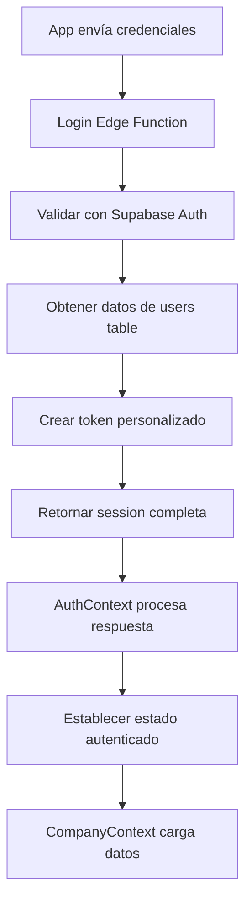
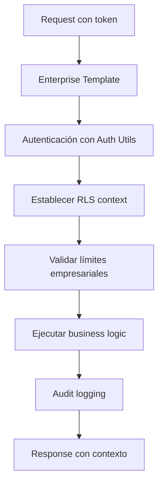
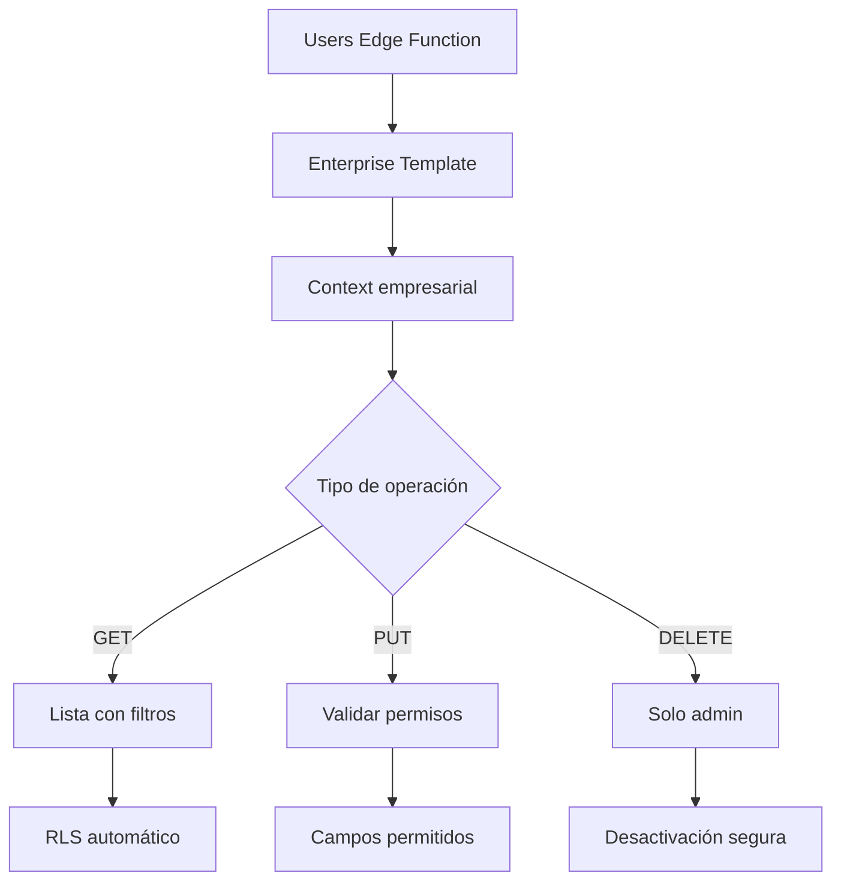

# 🚀 Documentación Completa: Edge Functions de AG-PYMEs

## 🎯 Índice

1. [**Login Edge Function - Sistema de Autenticación**](#login-edge-function---sistema-de-autenticación)
2. [**Register Edge Function - Sistema de Registro**](#register-edge-function---sistema-de-registro)
3. [**Users Edge Function - Gestión de Usuarios**](#users-edge-function---gestión-de-usuarios)
4. [**Companies Edge Function - Gestión de Empresas**](#companies-edge-function---gestión-de-empresas)
5. [**Enterprise Template - Arquitectura Unificada**](#enterprise-template---arquitectura-unificada)
6. [**Auth Utils - Utilidades de Seguridad**](#auth-utils---utilidades-de-seguridad)
7. [**Flujos de Integración**](#flujos-de-integración)

---

## 🔐 Login Edge Function - Sistema de Autenticación

### **🏗️ Arquitectura General**

La función `login` implementa un sistema de autenticación robusto que combina:

- **Supabase Auth nativo**: Para manejo seguro de tokens
- **Validación de credenciales**: Con múltiples niveles de seguridad
- **Integración dual**: auth.users + public.users
- **Verificación de tokens**: Con estrategias múltiples

### **📊 Endpoints Disponibles**

| Método | Endpoint                | Propósito                        |
| ------ | ----------------------- | -------------------------------- |
| `GET`  | `/`                     | Información del controlador      |
| `POST` | `/auth/login`           | Autenticación de usuario         |
| `POST` | `/auth/reset-password`  | Solicitud de reset de contraseña |
| `POST` | `/auth/change-password` | Cambio de contraseña             |
| `GET`  | `/auth/verify`          | Verificación de token            |

---

## 🔧 Funciones del Login Controller

### **1️⃣ `loginUser(loginData)` - Autenticación Principal**

```typescript
async function loginUser(loginData) {
  const { email, contrasena } = loginData;

  // Fase 1: Validaciones de entrada
  if (!validateEmail(email)) {
    throw new Error("Email inválido");
  }

  if (!validatePassword(contrasena)) {
    throw new Error("Contraseña debe tener al menos 8 caracteres");
  }

  // Fase 2: Autenticación con Supabase Auth
  const supabaseClient = createClient(
    Deno.env.get("SUPABASE_URL"),
    Deno.env.get("SUPABASE_ANON_KEY")
  );

  const { data: authData, error: authError } =
    await supabaseClient.auth.signInWithPassword({
      email: email,
      password: contrasena,
    });

  // Fase 3: Obtener perfil completo
  const supabaseAdmin = createClient(
    Deno.env.get("SUPABASE_URL"),
    Deno.env.get("SUPABASE_SERVICE_ROLE_KEY")
  );

  const { data: userData } = await supabaseAdmin
    .from("users")
    .select("*")
    .eq("id", authData.user.id)
    .single();

  // Fase 4: Crear token personalizado
  const payload = {
    id_usuario: userData.id,
    email: userData.email,
    nombre: userData.nombre,
    company_id: userData.company_id,
    rol: userData.rol,
    iat: Math.floor(Date.now() / 1000),
    exp: Math.floor(Date.now() / 1000) + 72 * 60 * 60,
  };

  const token = btoa(JSON.stringify(payload));

  return {
    token,
    user: userData,
    supabase_session: authData.session,
  };
}
```

**🎯 Características Clave:**

- ✅ **Validación dual**: Email + contraseña con regex
- ✅ **Integración completa**: auth.users + public.users
- ✅ **Tokens seguros**: JWT + Supabase session
- ✅ **Error handling**: Manejo específico por tipo de error

---

### **2️⃣ `requestPasswordReset(email)` - Reset de Contraseña**

```typescript
async function requestPasswordReset(email) {
  // Fase 1: Validar formato de email
  if (!validateEmail(email)) {
    throw new Error("Email inválido");
  }

  // Fase 2: Verificar que el usuario existe
  const supabaseAdmin = createClient(
    Deno.env.get("SUPABASE_URL"),
    Deno.env.get("SUPABASE_SERVICE_ROLE_KEY")
  );

  const { data: userData } = await supabaseAdmin
    .from("users")
    .select("id, email")
    .eq("email", email)
    .single();

  if (!userData) {
    throw new Error("Usuario no encontrado");
  }

  // Fase 3: Enviar email de reset
  const supabaseClient = createClient(
    Deno.env.get("SUPABASE_URL"),
    Deno.env.get("SUPABASE_ANON_KEY")
  );

  await supabaseClient.auth.resetPasswordForEmail(email, {
    redirectTo: `${Deno.env.get("FRONTEND_URL")}/reset-password`,
  });

  return {
    message: "Correo de restablecimiento enviado",
    email: email,
  };
}
```

**🎯 Flujo de Reset:**

- ✅ **Validación previa**: Verifica que el usuario existe
- ✅ **Supabase nativo**: Usa el sistema de reset integrado
- ✅ **Redirect configurable**: URL personalizable
- ✅ **Respuesta segura**: No revela información sensible

---

### **3️⃣ `changePassword(userId, passwords)` - Cambio de Contraseña**

```typescript
async function changePassword(userId, passwords) {
  const { current_password, new_password } = passwords;

  // Fase 1: Validaciones de contraseña
  if (!validatePassword(new_password)) {
    throw new Error("Nueva contraseña debe tener al menos 8 caracteres");
  }

  if (!validateStrongPassword(new_password)) {
    throw new Error(
      "Nueva contraseña debe contener mayúsculas, minúsculas, números y caracteres especiales"
    );
  }

  // Fase 2: Verificar contraseña actual
  const { data: userData } = await supabaseAdmin.auth.admin.getUserById(userId);

  const { data: authData } = await supabaseAdmin.auth.signInWithPassword({
    email: userData.user.email,
    password: current_password,
  });

  if (!authData) {
    throw new Error("Contraseña actual incorrecta");
  }

  // Fase 3: Actualizar contraseña
  await supabaseAdmin.auth.admin.updateUserById(userId, {
    password: new_password,
  });

  return {
    message: "Contraseña actualizada exitosamente",
  };
}
```

**🎯 Seguridad del Cambio:**

- ✅ **Verificación actual**: Valida contraseña actual antes del cambio
- ✅ **Políticas fuertes**: Regex para contraseñas seguras
- ✅ **Admin API**: Usa privilegios administrativos para el cambio
- ✅ **Logging de seguridad**: Registra todos los cambios

---

### **4️⃣ `extractUserId(request)` - Extracción de Usuario**

```typescript
async function extractUserId(request) {
  const authHeader = request.headers.get("Authorization");

  if (!authHeader) {
    return null;
  }

  // Estrategia 1: Token personalizado (base64)
  if (!authHeader.includes(".")) {
    try {
      const token = authHeader.replace("Bearer ", "");
      const payload = JSON.parse(atob(token));
      return payload.id_usuario;
    } catch {
      // Continuar a estrategia 2
    }
  }

  // Estrategia 2: JWT de Supabase
  const token = authHeader.replace("Bearer ", "");

  // Intentar con ANON_KEY primero
  const supabaseClient = createClient(
    Deno.env.get("SUPABASE_URL"),
    Deno.env.get("SUPABASE_ANON_KEY")
  );

  const {
    data: { user },
  } = await supabaseClient.auth.getUser(token);

  if (user) {
    return user.id;
  }

  // Fallback: SERVICE_ROLE_KEY
  const supabaseAdmin = createClient(
    Deno.env.get("SUPABASE_URL"),
    Deno.env.get("SUPABASE_SERVICE_ROLE_KEY")
  );

  const {
    data: { user: adminUser },
  } = await supabaseAdmin.auth.getUser(token);

  return adminUser?.id || null;
}
```

**🎯 Estrategias Múltiples:**

- ✅ **Token personalizado**: Base64 para desarrollo
- ✅ **JWT Supabase**: Estándar de producción
- ✅ **Fallback robusto**: Múltiples niveles de validación
- ✅ **Logging detallado**: Para debugging

---

## 📝 Register Edge Function - Sistema de Registro

### **🏗️ Arquitectura de Registro**

El sistema de registro implementa dos modos principales:

- **Modo CREATE**: Crear nueva empresa con usuario administrador
- **Modo JOIN**: Unirse a empresa existente con código de invitación

### **📊 Endpoints del Register Controller**

| Método | Endpoint               | Propósito                            |
| ------ | ---------------------- | ------------------------------------ |
| `POST` | `/`                    | Registro de usuario (create/join)    |
| `POST` | `/validate-invitation` | Validar código de invitación         |
| `POST` | `/check-company-code`  | Verificar disponibilidad de código   |
| `GET`  | `/plans`               | Información de planes de suscripción |

---

## 🔧 Funciones del Register Controller

### **1️⃣ Registro Principal - Modo CREATE**

```typescript
// Validaciones iniciales
if (
  !validateEmail(email) ||
  !validatePassword(password) ||
  !validateName(nombre)
) {
  throw new Error("Datos de entrada inválidos");
}

// Crear empresa nueva
if (mode === "create") {
  const planLimits = getPlanLimits(companyData.subscriptionPlan || "basic");

  // Generar código único de empresa
  const { data: companyCode } = await supabaseAdmin.rpc(
    "generate_company_code",
    {
      company_name: companyData.companyName,
    }
  );

  // Crear empresa en la base de datos
  const { data: company } = await supabaseAdmin
    .from("companies")
    .insert({
      company_name: companyData.companyName,
      company_code: companyCode,
      subscription_plan: companyData.subscriptionPlan || "basic",
      tax_rate: companyData.taxRate || 21.0,
      default_currency: companyData.defaultCurrency || "EUR",
      ...planLimits,
      is_active: true,
    })
    .select()
    .single();

  companyId = company.id;
}
```

**🎯 Características del Modo CREATE:**

- ✅ **Empresa nueva**: Crea toda la estructura empresarial
- ✅ **Código único**: Generación automática con función DB
- ✅ **Límites por plan**: Configuración automática según suscripción
- ✅ **Configuración inicial**: Valores por defecto empresariales

---

### **2️⃣ Registro Principal - Modo JOIN**

```typescript
// Unirse a empresa existente
if (mode === "join") {
  // Validar código de invitación
  const { data: invitation } = await supabaseAdmin
    .from("company_invitations")
    .select(
      `
      company_id,
      companies (
        id,
        company_name,
        is_active
      )
    `
    )
    .eq("invitation_code", invitationCode)
    .eq("status", "pending")
    .gte("expires_at", new Date().toISOString())
    .single();

  if (!invitation || !invitation.companies.is_active) {
    throw new Error("Código de invitación inválido o empresa inactiva");
  }

  companyId = invitation.company_id;

  // Marcar invitación como usada
  await supabaseAdmin
    .from("company_invitations")
    .update({
      status: "used",
      used_at: new Date().toISOString(),
    })
    .eq("invitation_code", invitationCode);
}
```

**🎯 Características del Modo JOIN:**

- ✅ **Validación de invitación**: Verifica código y expiración
- ✅ **Estado de empresa**: Confirma que esté activa
- ✅ **Uso único**: Marca invitación como utilizada
- ✅ **Auditoría**: Registro de cuándo se usó la invitación

---

### **3️⃣ `validateInvitation(invitationCode)` - Validación de Códigos**

```typescript
const { data: invitation } = await supabaseAdmin
  .from("company_invitations")
  .select(
    `
    invitation_code,
    status,
    expires_at,
    companies (
      company_name,
      is_active
    )
  `
  )
  .eq("invitation_code", invitationCode)
  .single();

// Validaciones múltiples
if (!invitation) {
  return { valid: false, message: "Código de invitación inválido" };
}

if (invitation.status !== "pending") {
  return { valid: false, message: "Código ya utilizado" };
}

if (new Date(invitation.expires_at) < new Date()) {
  return { valid: false, message: "Código expirado" };
}

if (!invitation.companies.is_active) {
  return { valid: false, message: "Empresa inactiva" };
}

return {
  valid: true,
  companyName: invitation.companies.company_name,
  message: "Código válido",
};
```

**🎯 Validaciones de Invitación:**

- ✅ **Existencia**: Verifica que el código existe
- ✅ **Estado**: Confirma que esté pendiente
- ✅ **Expiración**: Valida fecha límite
- ✅ **Empresa activa**: Verifica estado empresarial

---

### **4️⃣ `getPlanLimits(plan)` - Configuración de Planes**

```typescript
function getPlanLimits(plan) {
  const limits = {
    basic: {
      max_users: 3,
      max_clients: 100,
      max_products: 200,
      max_storage_mb: 100,
    },
    pro: {
      max_users: 10,
      max_clients: 500,
      max_products: 1000,
      max_storage_mb: 500,
    },
    enterprise: {
      max_users: 50,
      max_clients: 2000,
      max_products: 5000,
      max_storage_mb: 2000,
    },
  };

  return limits[plan] || limits.basic;
}
```

**🎯 Planes de Suscripción:**

- **Basic**: Para pequeños negocios (3 usuarios, 100 clientes)
- **Pro**: Para empresas en crecimiento (10 usuarios, 500 clientes)
- **Enterprise**: Para grandes organizaciones (50 usuarios, 2000 clientes)

---

## 👥 Users Edge Function - Gestión de Usuarios

### **🏗️ Arquitectura de Usuarios**

La función `users` utiliza el **Enterprise Template** para proporcionar:

- **Autenticación automática** con context empresarial
- **RLS (Row Level Security)** automático por empresa
- **Validación de límites** empresariales
- **Auditoría completa** de operaciones

### **📊 Endpoints del Users Controller**

| Método   | Endpoint   | Propósito                                    |
| -------- | ---------- | -------------------------------------------- |
| `GET`    | `/`        | Lista de usuarios (con paginación y filtros) |
| `GET`    | `/current` | Datos del usuario actual                     |
| `GET`    | `/:id`     | Datos de usuario específico                  |
| `PUT`    | `/:id`     | Actualizar usuario                           |
| `DELETE` | `/:id`     | Desactivar usuario                           |

---

## 🔧 Funciones del Users Controller

### **1️⃣ `getUsersList(supabase, context, queryParams)` - Lista Paginada**

```typescript
async function getUsersList(supabase, context, queryParams) {
  // Configuración de paginación
  const page = parseInt(queryParams.get("page") || "1");
  const limit = Math.min(parseInt(queryParams.get("limit") || "50"), 100);
  const offset = (page - 1) * limit;

  // Filtros dinámicos
  const search = queryParams.get("search");
  const rol = queryParams.get("rol");
  const activo = queryParams.get("activo");

  let query = supabase
    .from("users")
    .select(
      `
      id,
      nombre,
      email,
      rol,
      is_active,
      fecha_registro,
      last_login,
      permissions
    `
    )
    .eq("company_id", context.company_id)
    .order("fecha_registro", { ascending: false });

  // Aplicar filtros condicionales
  if (search) {
    query = query.or(`nombre.ilike.%${search}%,email.ilike.%${search}%`);
  }

  if (rol && rol !== "all") {
    query = query.eq("rol", rol);
  }

  if (activo && activo !== "all") {
    query = query.eq("is_active", activo === "true");
  }

  // Aplicar paginación
  query = query.range(offset, offset + limit - 1);

  const { data: users } = await query;

  // Contar total para paginación
  const { count } = await supabase
    .from("users")
    .select("id", { count: "exact", head: true })
    .eq("company_id", context.company_id);

  const totalPages = Math.ceil((count || 0) / limit);

  return {
    users,
    pagination: {
      page,
      limit,
      total: count || 0,
      totalPages,
      hasNext: page < totalPages,
      hasPrev: page > 1,
    },
  };
}
```

**🎯 Características de la Lista:**

- ✅ **Paginación inteligente**: Límite máximo de 100 por página
- ✅ **Filtros múltiples**: Búsqueda, rol, estado activo
- ✅ **RLS automático**: Solo usuarios de la empresa actual
- ✅ **Metadatos de paginación**: Total, páginas, navegación

---

### **2️⃣ `updateUser(supabase, context, userId, updateData)` - Actualización**

```typescript
async function updateUser(supabase, context, userId, updateData) {
  // Verificar permisos
  if (context.user_id !== userId && context.role !== "admin") {
    throw new Error("Permisos insuficientes para actualizar otros usuarios");
  }

  // Campos permitidos para actualización
  const allowedFields = [
    "nombre",
    "rol",
    "is_active",
    "permissions",
    "user_settings",
  ];

  const filteredData = {};
  allowedFields.forEach((field) => {
    if (updateData.hasOwnProperty(field)) {
      filteredData[field] = updateData[field];
    }
  });

  // Validar rol si se está actualizando
  if (filteredData.rol) {
    const validRoles = ["admin", "empleado", "viewer"];
    if (!validRoles.includes(filteredData.rol)) {
      throw new Error(`Rol inválido: ${filteredData.rol}`);
    }
  }

  filteredData.updated_at = new Date().toISOString();

  const { data: updatedUser } = await supabase
    .from("users")
    .update(filteredData)
    .eq("id", userId)
    .eq("company_id", context.company_id)
    .select()
    .single();

  // Sincronizar con auth.users metadata
  if (filteredData.rol) {
    await supabase.auth.admin.updateUserById(userId, {
      user_metadata: {
        role: filteredData.rol,
        company_id: context.company_id,
      },
    });
  }

  return updatedUser;
}
```

**🎯 Seguridad de Actualización:**

- ✅ **Control de permisos**: Solo admin puede actualizar otros usuarios
- ✅ **Campos permitidos**: Lista blanca de campos editables
- ✅ **Validación de roles**: Solo roles válidos permitidos
- ✅ **Sincronización metadata**: Mantiene consistencia con auth.users

---

### **3️⃣ `deactivateUser(supabase, context, userId)` - Desactivación**

```typescript
async function deactivateUser(supabase, context, userId) {
  // Solo admins pueden desactivar usuarios
  if (context.role !== "admin") {
    throw new Error("Solo administradores pueden desactivar usuarios");
  }

  // No puede desactivarse a sí mismo
  if (context.user_id === userId) {
    throw new Error("No puedes desactivarte a ti mismo");
  }

  const { data: deactivatedUser } = await supabase
    .from("users")
    .update({
      is_active: false,
      updated_at: new Date().toISOString(),
    })
    .eq("id", userId)
    .eq("company_id", context.company_id)
    .select()
    .single();

  return deactivatedUser;
}
```

**🎯 Reglas de Desactivación:**

- ✅ **Solo administradores**: Control de acceso estricto
- ✅ **Protección propia**: No puede desactivarse a sí mismo
- ✅ **RLS empresarial**: Solo usuarios de la misma empresa
- ✅ **Auditoría**: Timestamp de desactivación

---

## 🏢 Companies Edge Function - Gestión de Empresas

### **🏗️ Arquitectura Empresarial**

La función `companies` proporciona gestión completa de datos empresariales:

- **Información de empresa**: Datos básicos y configuraciones
- **Estadísticas de uso**: Monitoreo de límites y consumo
- **Validación de límites**: Control de capacidad por plan
- **Gestión de invitaciones**: Códigos para nuevos usuarios

### **📊 Endpoints del Companies Controller**

| Método | Endpoint          | Propósito                       |
| ------ | ----------------- | ------------------------------- |
| `GET`  | `/current`        | Datos de empresa actual         |
| `GET`  | `/settings`       | Configuraciones de empresa      |
| `PUT`  | `/settings`       | Actualizar configuraciones      |
| `GET`  | `/usage`          | Estadísticas de uso             |
| `POST` | `/validate-limit` | Validar límites empresariales   |
| `POST` | `/invitation`     | Generar código de invitación    |
| `GET`  | `/users`          | Usuarios de la empresa          |
| `GET`  | `/limits`         | Información de límites del plan |
| `PUT`  | `/current`        | Actualizar datos de empresa     |

---

## 🔧 Funciones del Companies Controller

### **1️⃣ `getCurrentCompany(context)` - Datos de Empresa**

```typescript
async function getCurrentCompany(context) {
  const { data } = await supabaseAdmin
    .from("companies")
    .select("*")
    .eq("id", context.company_id)
    .single();

  if (!data) {
    throw new Error("Empresa no encontrada");
  }

  return data;
}
```

**🎯 Información Completa:**

- ✅ **Datos básicos**: Nombre, código, plan de suscripción
- ✅ **Límites**: Capacidades máximas por recurso
- ✅ **Configuraciones**: Moneda, tasa de impuestos
- ✅ **Estado**: Activo/inactivo, fechas de creación

---

### **2️⃣ `getCompanyUsage(context)` - Estadísticas de Uso**

```typescript
async function getCompanyUsage(context) {
  const { data: usageStats } = await supabaseAdmin.rpc(
    "get_company_usage_stats",
    {
      company_uuid: context.company_id,
    }
  );

  return (
    usageStats || {
      users: 0,
      clients: 0,
      products: 0,
      appointments: 0,
      services: 0,
      storageMB: 0,
    }
  );
}
```

**🎯 Métricas Monitoreadas:**

- ✅ **Usuarios**: Cantidad de usuarios activos
- ✅ **Clientes**: Número de clientes registrados
- ✅ **Productos**: Productos en inventario
- ✅ **Almacenamiento**: Uso en MB de archivos
- ✅ **Servicios**: Servicios ofrecidos
- ✅ **Citas**: Citas programadas

---

### **3️⃣ `validateCompanyLimit(context, body)` - Validación de Límites**

```typescript
async function validateCompanyLimit(context, body) {
  const { resource, amount = 1 } = body;

  // Validar límites usando función nativa de DB
  const { data: limitCheck } = await supabaseAdmin.rpc("check_company_limits", {
    company_uuid: context.company_id,
    resource_type: resource,
  });

  // Obtener estadísticas actuales
  const { data: usageStats } = await supabaseAdmin.rpc(
    "get_company_usage_stats",
    {
      company_uuid: context.company_id,
    }
  );

  // Obtener límites de la empresa
  const { data: company } = await supabaseAdmin
    .from("companies")
    .select("max_users, max_clients, max_products, max_storage_mb")
    .eq("id", context.company_id)
    .single();

  // Calcular métricas específicas
  let currentUsage = 0;
  let maxLimit = 0;

  switch (resource) {
    case "users":
      currentUsage = usageStats.users || 0;
      maxLimit = company.max_users;
      break;
    case "clients":
      currentUsage = usageStats.clients || 0;
      maxLimit = company.max_clients;
      break;
    case "products":
      currentUsage = usageStats.products || 0;
      maxLimit = company.max_products;
      break;
    case "storage":
      currentUsage = usageStats.storageMB || 0;
      maxLimit = company.max_storage_mb;
      break;
  }

  const allowed = limitCheck === true;
  const remaining = Math.max(0, maxLimit - currentUsage);

  return {
    allowed,
    currentUsage,
    maxLimit,
    remaining,
    resource,
    wouldExceed: !allowed,
    percentUsed: maxLimit > 0 ? Math.round((currentUsage / maxLimit) * 100) : 0,
  };
}
```

**🎯 Validación Inteligente:**

- ✅ **Función DB nativa**: Usa `check_company_limits()`
- ✅ **Métricas detalladas**: Uso actual, límite, restante
- ✅ **Porcentaje de uso**: Fácil visualización
- ✅ **Recursos múltiples**: Valida users, clients, products, storage

---

### **4️⃣ `generateInvitation(context)` - Códigos de Invitación**

```typescript
async function generateInvitation(context) {
  // Generar código usando función DB nativa
  const { data: invitationCode } = await supabaseAdmin.rpc(
    "generate_invitation_code"
  );

  const { data } = await supabaseAdmin
    .from("company_invitations")
    .insert({
      company_id: context.company_id,
      invitation_code: invitationCode,
      status: "pending",
      expires_at: new Date(Date.now() + 7 * 24 * 60 * 60 * 1000).toISOString(), // 7 días
    })
    .select()
    .single();

  return data;
}
```

**🎯 Sistema de Invitaciones:**

- ✅ **Códigos únicos**: Generación automática sin colisiones
- ✅ **Expiración**: 7 días de validez
- ✅ **Estado tracking**: pending → used
- ✅ **Auditoría**: Registro completo de uso

---

## 🚀 Enterprise Template - Arquitectura Unificada

### **🏗️ Patrón Enterprise**

El `Enterprise Template` proporciona una base unificada para todas las Edge Functions:

```typescript
export function createEnterpriseHandler(businessLogic: BusinessLogicHandler) {
  return async function handler(req: Request) {
    // 1. Manejo de CORS
    const corsHeaders = {
      /* headers estándar */
    };

    // 2. Autenticación con funciones DB nativas
    const context = await authenticateWithDB(req);

    // 3. Establecer contexto RLS automáticamente
    await supabaseAdmin.rpc("set_current_company_id", {
      company_uuid: context.company_id,
    });

    // 4. Validar límites empresariales
    const limitsCheck = await validateCompanyLimits(context, req);

    // 5. Audit logging
    await auditLog("API_ACCESS", context, {
      /* metadata */
    });

    // 6. Ejecutar business logic
    const result = await businessLogic(req, context);

    // 7. Response exitosa con contexto
    return new Response(
      JSON.stringify({
        success: true,
        data: result,
        context: {
          company_id: context.company_id,
          timestamp: new Date().toISOString(),
        },
      })
    );
  };
}
```

**🎯 Beneficios del Template:**

- ✅ **Consistencia**: Mismo patrón en todas las funciones
- ✅ **Seguridad automática**: RLS y autenticación integrados
- ✅ **Límites empresariales**: Validación automática
- ✅ **Auditoría**: Logging completo y automático
- ✅ **Error handling**: Respuestas estandarizadas

---

### **📊 Funciones del Enterprise Template**

#### **`authenticateWithDB(req)` - Autenticación Unificada**

```typescript
async function authenticateWithDB(
  req: Request
): Promise<EnterpriseContext | Response> {
  const authHeader = req.headers.get("authorization");

  if (!authHeader?.startsWith("Bearer ")) {
    return errorResponses.missingAuth();
  }

  const token = authHeader.replace("Bearer ", "");

  // Usar funciones AUTH nativas de Supabase
  const { data: userData, error } = await supabaseAdmin.auth.getUser(token);

  if (error || !userData?.user) {
    return errorResponses.invalidToken();
  }

  // Extraer company_id del JWT metadata (SEGURO)
  const company_id = userData.user.user_metadata?.company_id;
  const role = userData.user.user_metadata?.role || "user";

  if (!company_id) {
    return errorResponses.noCompany();
  }

  return {
    user_id: userData.user.id,
    email: userData.user.email || "",
    company_id,
    role,
  };
}
```

#### **`validateCompanyLimits(context, req)` - Validación Inteligente**

```typescript
async function validateCompanyLimits(context, req): Promise<void | Response> {
  const method = req.method;
  const pathname = new URL(req.url).pathname;

  // Skip validation para operaciones de lectura
  if (method === "GET") {
    return;
  }

  // Endpoints exentos de validación
  const exemptEndpoints = ["/current", "/settings", "/verify"];
  if (exemptEndpoints.some((endpoint) => pathname.includes(endpoint))) {
    return;
  }

  // Determinar tipo de recurso según endpoint
  let resourceType = "users";
  if (pathname.includes("/clients")) resourceType = "clients";
  if (pathname.includes("/products")) resourceType = "products";
  if (pathname.includes("/storage")) resourceType = "storage";

  // Validar límites usando función DB
  const { data: withinLimits } = await supabaseAdmin.rpc(
    "check_company_limits",
    {
      company_uuid: context.company_id,
      resource_type: resourceType,
    }
  );

  if (!withinLimits) {
    const { data: usage } = await supabaseAdmin.rpc("get_company_usage_stats", {
      company_uuid: context.company_id,
    });

    return errorResponses.companyLimitExceeded(context.company_id, usage);
  }
}
```

---

## 🔒 Auth Utils - Utilidades de Seguridad

### **🛡️ Sistema de Autenticación Segura**

Las `Auth Utils` proporcionan utilidades de seguridad para reemplazar métodos inseguros:

### **📊 Funciones Principales**

#### **`getSecureAuthData(authHeader)` - Extracción Segura**

```typescript
export async function getSecureAuthData(
  authHeader: string | null
): Promise<SecureAuthData | null> {
  if (!authHeader || !authHeader.startsWith("Bearer ")) {
    return null;
  }

  const token = authHeader.substring(7);

  // Usar Supabase para validar el token de forma segura
  const {
    data: { user },
    error,
  } = await supabaseAdmin.auth.getUser(token);

  if (error || !user) {
    return null;
  }

  // Extraer company_id de user_metadata (método seguro)
  const company_id = user.user_metadata?.company_id;
  const role = user.user_metadata?.role || "user";

  if (!company_id) {
    return null;
  }

  return {
    user_id: user.id,
    company_id: company_id,
    role: role,
    email: user.email || "",
    isAuthenticated: true,
  };
}
```

#### **`requireAuthentication(req)` - Middleware de Autenticación**

```typescript
export async function requireAuthentication(
  req: Request
): Promise<SecureAuthData | Response> {
  const authHeader = req.headers.get("Authorization");
  const authData = await getSecureAuthData(authHeader);

  if (!authData) {
    return new Response(
      JSON.stringify({
        error: "Unauthorized",
        message: "Valid authentication required",
        code: "AUTH_REQUIRED",
      }),
      {
        status: 401,
        headers: { "Content-Type": "application/json" },
      }
    );
  }

  return authData;
}
```

#### **Utilidades de Validación**

```typescript
// Validar acceso a empresa
export function hasCompanyAccess(
  authData: SecureAuthData,
  targetCompanyId: string
): boolean {
  return authData.company_id === targetCompanyId;
}

// Validar rol específico
export function hasRole(
  authData: SecureAuthData,
  requiredRole: string
): boolean {
  return authData.role === requiredRole;
}

// Validar si es administrador
export function isAdmin(authData: SecureAuthData): boolean {
  return authData.role === "admin";
}
```

**🎯 Ventajas de Auth Utils:**

- ✅ **Seguridad garantizada**: Validación con Supabase Auth
- ✅ **Metadata del JWT**: Extracción segura de company_id
- ✅ **Funciones de utilidad**: Helpers para validaciones comunes
- ✅ **Error handling**: Respuestas estandarizadas

---

## 🔄 Flujos de Integración

### **📊 Flujo Completo de Autenticación**



### **🏢 Flujo de Gestión Empresarial**



### **👥 Flujo de Gestión de Usuarios**



---

## 🎯 Características Principales del Sistema

### **🔐 Seguridad Empresarial**

- ✅ **RLS automático**: Aislamiento por empresa en todas las operaciones
- ✅ **Autenticación dual**: Supabase Auth + validación personalizada
- ✅ **Metadata seguro**: company_id extraído del JWT de forma segura
- ✅ **Validación de permisos**: Control granular por rol y empresa

### **📊 Gestión de Límites**

- ✅ **Validación automática**: Límites empresariales validados en cada operación
- ✅ **Estadísticas en tiempo real**: Uso actual vs límites del plan
- ✅ **Funciones DB nativas**: `check_company_limits()` y `get_company_usage_stats()`
- ✅ **Escalabilidad**: Soporte para múltiples planes de suscripción

### **🚀 Arquitectura Enterprise**

- ✅ **Template unificado**: Patrón consistente en todas las Edge Functions
- ✅ **Error handling**: Respuestas estandarizadas y logging completo
- ✅ **Auditoría automática**: Registro de todas las operaciones
- ✅ **CORS automático**: Manejo transparente de cross-origin requests

### **⚡ Performance y Escalabilidad**

- ✅ **Funciones DB nativas**: Operaciones optimizadas en la base de datos
- ✅ **Paginación inteligente**: Límites automáticos para prevenir sobrecarga
- ✅ **Caching inteligente**: Reutilización de contexto y validaciones
- ✅ **Lazy loading**: Carga de datos bajo demanda

---

## 🎯 Conclusión

Las Edge Functions de AG-PYMEs forman un sistema empresarial robusto y escalable que:

1. **Proporciona autenticación segura** con integración dual Supabase Auth + custom
2. **Implementa aislamiento empresarial** con RLS automático y validación de contexto
3. **Gestiona límites inteligentemente** con validación automática por plan de suscripción
4. **Mantiene consistencia arquitectónica** con Enterprise Template unificado
5. **Garantiza seguridad empresarial** con Auth Utils y validaciones robustas

Este sistema está diseñado para ser **escalable, seguro y mantenible**, proporcionando una API empresarial completa para la aplicación AG-PYMEs.
