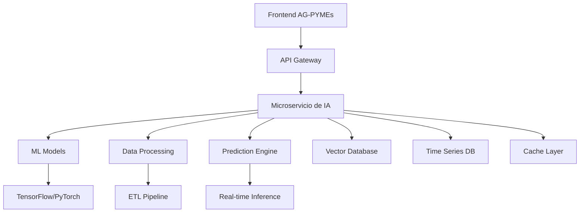

# Propuestas de Mejora e Innovación con IA para AG-PYMEs

## 📋 Índice

1. [Análisis del Estado Actual](#análisis-del-estado-actual)
2. [Propuestas de IA y Automatización](#propuestas-de-ia-y-automatización)
3. [Mejoras en Analytics y Business Intelligence](#mejoras-en-analytics-y-business-intelligence)
4. [Optimización de Procesos Existentes](#optimización-de-procesos-existentes)
5. [Nuevas Funcionalidades con IA](#nuevas-funcionalidades-con-ia)
6. [Mejoras Tradicionales de Alto Impacto](#mejoras-tradicionales-de-alto-impacto)
7. [Roadmap de Implementación](#roadmap-de-implementación)

---

## 🔍 Análisis del Estado Actual

### Fortalezas Identificadas

El sistema AG-PYMEs ya cuenta con una base sólida:

- ✅ Dashboard inteligente con métricas en tiempo real
- ✅ Sistema de alertas automatizado
- ✅ Análisis de rentabilidad y márgenes
- ✅ Gestión completa de inventario con alertas de stock
- ✅ Cierre diario automatizado
- ✅ Monitoreo de performance y rendimiento
- ✅ Generación automática de reportes
- ✅ Sistema de citas con verificación de disponibilidad

### Áreas de Oportunidad

1. **Predicción y Análisis Predictivo**: Falta de modelos predictivos
2. **Automatización Inteligente**: Procesos manuales que pueden automatizarse
3. **Análisis de Comportamiento**: Patrones de clientes y empleados
4. **Optimización Dinámica**: Precios, turnos y recursos
5. **Inteligencia de Negocio Avanzada**: Insights más profundos

---

## 🤖 Propuestas de IA y Automatización

### 1. Sistema de Predicción de Demanda

**Objetivo**: Predecir la demanda de productos y servicios basándose en el historial de ventas existente

**Integración en AG-PYMEs**:
El sistema se integraría directamente con el módulo de inventario existente y el dashboard de analytics. Utilizaría los datos históricos de ventas que ya se capturan en `salesController.js` y los complementaría con:

**Fuentes de Datos del Sistema Actual**:

- Historial de ventas por producto (`sales`, `sale_products`)
- Patrones estacionales detectados en el dashboard
- Datos de clientes y su comportamiento de compra
- Información de proveedores y tiempos de entrega
- Alertas de stock bajo ya implementadas

**Funcionamiento Propuesto**:

1. **Análisis de Patrones Temporales**: El sistema analizaría los datos existentes del `DashboardController` que ya calcula ventas por período para identificar:

   - Picos de ventas por día de la semana
   - Variaciones estacionales (navidades, rebajas, temporadas específicas)
   - Tendencias de crecimiento o declive por producto

2. **Predicción Inteligente de Reorders**: Integrado con el sistema actual de gestión de pedidos (`orders`, `orderController`), sugeriría automáticamente:

   - Cuándo realizar pedidos a proveedores
   - Qué cantidades solicitar basándose en demanda prevista
   - Optimización de costos de almacenamiento vs riesgo de rotura de stock

3. **Alertas Predictivas Mejoradas**: Extendiendose del sistema de alertas actual, incluiría:
   - "Producto X se agotará en 5 días basado en tendencia actual"
   - "Demanda de Producto Y aumentará 40% la próxima semana"
   - "Oportunidad: incrementar stock de Producto Z antes del pico estacional"

**Implementación Específica**:

- **Dashboard Predictivo**: Nueva sección en `HomeScreen.js` mostrando predicciones de los próximos 30 días
- **Inventario Inteligente**: Extensión de `InventoryScreen.js` con indicadores de demanda futura
- **Automatización de Pedidos**: Integración con el flujo existente de pedidos para sugerir reabastecimientos

**Beneficios Medibles**:

- 25-35% reducción en roturas de stock
- 15-20% optimización en costos de inventario
- 30-40% mejora en predicción de flujo de caja
- Automatización del 70% de decisiones de reabastecimiento

### 2. Asistente Virtual Inteligente para Punto de Venta

**Objetivo**: Crear un asistente IA que optimice el proceso de ventas y brinde soporte inteligente

**Integración Profunda con SalesPointScreen**:
El chatbot se integraría directamente en la interfaz del punto de venta existente (`SalesPointScreen.js`), aprovechando toda la funcionalidad ya desarrollada:

**Funcionalidades Específicas en AG-PYMEs**:

1. **Asistencia de Ventas Contextual**:

   - **Búsqueda Inteligente**: "Encuentra productos similares al lápiz azul" → utiliza la búsqueda existente en `ProductSelector.js` con IA semántica
   - **Sugerencias de Productos**: Basado en el cliente seleccionado y su historial, sugiere productos complementarios
   - **Asesoramiento de Precios**: "¿Qué precio debería poner a este producto?" → analiza competencia y márgenes

2. **Automatización de Procesos de Venta**:

   - **Creación Rápida de Presupuestos**: "Crear presupuesto para cliente habitual con productos de oficina"
   - **Gestión de Descuentos Inteligente**: Sugiere descuentos apropiados basado en perfil del cliente y política de la empresa
   - **Procesamiento de Devoluciones**: Guía paso a paso para manejar devoluciones complejas

3. **Soporte de Inventario en Tiempo Real**:

   - **Verificación de Stock**: "¿Tenemos stock del producto X?" → conecta con la base de datos de inventario
   - **Localización de Productos**: "¿Dónde está ubicado el producto Y en el almacén?"
   - **Alertas de Reposición**: "Este producto se está agotando, ¿genero pedido a proveedor?"

4. **Gestión de Clientes Mejorada**:
   - **Búsqueda Inteligente de Clientes**: "Busca el cliente que compró la máquina registradora el mes pasado"
   - **Historial Contextual**: Muestra automáticamente preferencias y patrones de compra
   - **Recordatorios de Seguimiento**: "Cliente X tiene una cita de mantenimiento pendiente"

**Implementación en la Interfaz Actual**:

- **Botón Flotante en SalesPointScreen**: Acceso rápido al asistente sin interrumpir el flujo de venta
- **Integración con CartComponent**: El asistente puede añadir/modificar items del carrito directamente
- **Panel Lateral Expandible**: En modo web, panel dedicado para interacciones más complejas

**Capacidades Técnicas Específicas**:

- **Acceso a APIs Existentes**: Utiliza todos los servicios ya desarrollados (`Services.Data.*`)
- **Comprensión del Contexto**: Entiende si estás en proceso de venta, consultando inventario, o gestionando cliente
- **Aprendizaje Continuo**: Mejora sus respuestas basándose en las acciones que realizas después de sus sugerencias

**Casos de Uso Reales**:

1. **Vendedor novato**: "¿Cómo hago una factura con descuento del 10%?" → Guía paso a paso
2. **Venta compleja**: "Cliente quiere 50 bolígrafos, 20 libretas y descuento por volumen" → Calcula automáticamente
3. **Problema técnico**: "La impresora no funciona" → Diagnóstico y soluciones paso a paso
4. **Análisis rápido**: "¿Cuáles son mis mejores clientes este mes?" → Genera reporte instantáneo

### 3. Motor de Recomendaciones Inteligentes

**Objetivo**: Sistema avanzado de recomendaciones que impulse las ventas cruzadas y mejore la experiencia del cliente

**Integración con el Flujo de Venta Actual**:
El sistema se integraría perfectamente en `SalesPointScreen.js` y `CartComponent.js`, utilizando la infraestructura existente para enriquecer el proceso de venta:

**Recomendaciones Contextuales en Tiempo Real**:

1. **Durante la Selección de Productos**:

   - **En ProductSelector.js**: Cuando se añade un producto al carrito, aparecen automáticamente productos complementarios
   - **Ejemplo Real**: Al añadir "Impresora HP" → sugiere "Cartuchos de tinta", "Papel A4", "Cable USB"
   - **Análisis de Compatibilidad**: Basado en especificaciones técnicas y patrones de compra históricos

2. **Recomendaciones Basadas en Cliente**:

   - **Perfil del Cliente**: Utiliza el historial de `ClientModal.js` para personalizar sugerencias
   - **Preferencias Detectadas**: "Este cliente siempre compra productos de marca premium" → prioriza sugerencias de gama alta
   - **Estacionalidad Personal**: "Cliente X siempre compra material escolar en enero" → recordatorio proactivo

3. **Recomendaciones de Servicios Inteligentes**:
   - **Cross-selling Producto-Servicio**: Al vender una máquina → sugiere servicio de instalación y mantenimiento
   - **Upselling de Servicios**: Cliente solicita servicio básico → sugiere versión premium basado en perfil y presupuesto

**Algoritmos de Recomendación Específicos**:

1. **Collaborative Filtering**:

   - "Clientes que compraron esto también compraron..."
   - Utiliza datos de `sales` y `sale_products` para identificar patrones

2. **Content-Based Filtering**:

   - Analiza características de productos (categoría, precio, marca)
   - Recomienda productos similares o complementarios

3. **Business Rules Engine**:
   - Reglas específicas del negocio: "Si compra >100€, sugerir envío gratis"
   - Promociones cruzadas: "Con producto A, producto B tiene 20% descuento"

**Implementación Visual en la Interfaz**:

1. **Panel de Recomendaciones en Cart**:

   - Sección expandible en `CartComponent.js`
   - Muestra 3-5 productos sugeridos con imágenes y precios
   - Botón "Añadir al carrito" con un solo click

2. **Notificaciones Inteligentes**:

   - Utilizando el sistema de notificaciones existente (`useNotifications`)
   - "💡 Sugerencia: Los clientes que compran esto suelen necesitar..."

3. **Métricas de Efectividad**:
   - Tracking de recomendaciones aceptadas vs rechazadas
   - A/B testing de diferentes algoritmos
   - ROI de cada tipo de recomendación

**Casos de Uso Específicos para PYMEs**:

1. **Panadería**: Cliente compra pan → sugiere mantequilla, mermelada, café
2. **Ferretería**: Cliente compra tornillos → sugiere taladro, brocas, nivel
3. **Oficina**: Cliente compra papel → sugiere archivadores, grapas, bolígrafos
4. **Servicios**: Cliente contrata limpieza → sugiere mantenimiento de jardín

**Inteligencia de Inventario**:

- **Stock Awareness**: No recomienda productos agotados
- **Rotación Inteligente**: Prioriza productos con stock excesivo
- **Margen Optimization**: Balancea recomendaciones entre satisfacción del cliente y rentabilidad

**Aprendizaje Continuo**:

- **Feedback Loop**: Cada venta alimenta el algoritmo
- **Adaptación Estacional**: Ajusta recomendaciones según época del año
- **Personalización Progresiva**: Mejora las sugerencias con cada interacción del cliente

### 4. Optimización Automática de Precios

**Concepto Central**: Un sistema inteligente que ajusta precios dinámicamente basándose en datos del mercado, comportamiento del cliente, niveles de inventario y objetivos de rentabilidad, transformando la gestión de precios de reactiva a proactiva.

**Aplicación en AG-PYMEs**:

**Integración con el Sistema de Inventario Actual**:
El sistema se conectaría directamente con `InventoryScreen.js` y la base de datos de productos para crear un motor de optimización de precios que funcione en tiempo real:

**Factores de Análisis Inteligente**:

1. **Análisis de Elasticidad de Demanda**:

   - **Datos Históricos**: Utiliza registros de `sales` y `sale_products` para determinar cómo responden las ventas a cambios de precio
   - **Segmentación por Cliente**: "Clientes premium son menos sensibles al precio", "Clientes corporativos responden a descuentos por volumen"
   - **Productos Sustitutos**: Identifica cuando un aumento de precio en producto A impulsa ventas de producto B

2. **Inteligencia Competitiva**:

   - **Monitoring de Mercado**: Tracking de precios de competencia (integrable con APIs de marketplace)
   - **Posicionamiento Estratégico**: "Mantenerse 5% por debajo del competidor líder" o "Premium pricing para productos únicos"
   - **Alertas de Movimientos**: Notificaciones cuando competencia cambia precios significativamente

3. **Optimización por Inventario**:

   - **Stock Alto**: Sugerir descuentos para acelerar rotación
   - **Stock Bajo**: Aumentar precios para maximizar margen mientras queda inventario
   - **Productos Estacionales**: Ajustar precios según proximidad de temporada baja

4. **Objetivos de Margen Dinámico**:
   - **Productos de Alta Rotación**: Margen más bajo para volumen
   - **Productos Nicho**: Margen alto por especialización
   - **Servicios Premium**: Pricing basado en valor percibido

**Implementación Visual en la Interfaz Actual**:

1. **Panel de Optimización en Inventario**:

   - Nueva pestaña en `InventoryScreen.js`: "💰 Optimización de Precios"
   - **Vista de Productos**: Lista con precio actual, precio sugerido y razón del cambio
   - **Semáforo Visual**: Verde (precio óptimo), Amarillo (puede mejorar), Rojo (precio problemático)

2. **Dashboard de Impacto**:

   - **Proyección de Ingresos**: "Aplicar estos cambios podría aumentar ingresos 12%"
   - **Análisis de Riesgo**: "Producto X: riesgo medio de reducir ventas 8%"
   - **ROI de Cambios**: Tracking del impacto real vs predicción

3. **Automatización Inteligente**:
   - **Reglas de Negocio**: "No cambiar precios más del 10% sin aprobación"
   - **Aplicación Programada**: Cambios automáticos en horarios de menor actividad
   - **A/B Testing**: Probar precios diferentes en segmentos de clientes

**Casos de Uso Específicos por Tipo de Negocio**:

1. **Restaurante**:

   - **Happy Hour Dinámico**: Precios reducidos automáticamente cuando detecta baja demanda
   - **Ingredientes Estacionales**: Ajusta precios de platos según costo de ingredientes
   - **Clima Intelligence**: Reduce precio de bebidas frías en días fríos

2. **Tienda de Ropa**:

   - **Fin de Temporada**: Descuentos progresivos automáticos
   - **Tallas/Colores**: Precios dinámicos basados en disponibilidad
   - **Tendencias**: Aumenta precios de productos virales, reduce obsoletos

3. **Servicios Profesionales**:
   - **Demanda-Hora**: Precios más altos en horarios peak
   - **Capacidad**: Descuentos cuando hay espacios libres
   - **Fidelización**: Precios especiales para clientes recurrentes

**Inteligencia Predictiva**:

1. **Escenarios What-If**:

   - "Si aumentamos precio 15%, perderíamos 20% de volumen pero aumentaríamos margen 8%"
   - Simulaciones de impacto antes de aplicar cambios

2. **Optimización Multiproducto**:

   - **Cross-Price Elasticity**: Considera cómo el precio de un producto afecta ventas de otros
   - **Bundle Optimization**: Precios de paquetes para maximizar ticket promedio

3. **Timing Inteligente**:
   - **Análisis de Patrones**: "Lunes es mejor día para subir precios", "Viernes para promociones"
   - **Eventos Especiales**: Ajustes automáticos para Black Friday, Navidad, etc.

**Métricas de Éxito y Learning**:

- **Revenue per Product**: Tracking individual y comparativo
- **Price Sensitivity Index**: Mide elasticidad real vs predicha
- **Customer Retention**: Impacto de cambios de precio en fidelidad
- **Competitive Position**: Posición relativa en el mercado
- **Margin Optimization Score**: Eficiencia del margen conseguido

### 5. Detección de Anomalías e Inteligencia Operacional

**Concepto Central**: Un sistema de monitoreo inteligente que detecta patrones inusuales y problemas potenciales antes de que se conviertan en crisis, actuando como un "vigilante digital" que nunca duerme.

**Aplicación en AG-PYMEs**:

**Integración con Módulos Existentes**:
El sistema se conectaría con todos los módulos actuales (`sales`, `inventory`, `employees`, `finances`) para crear una red de sensores inteligentes que detecten anomalías en tiempo real:

**Tipos de Anomalías y Detección Inteligente**:

1. **Anomalías de Ventas**:

   - **Caídas Repentinas**: "Ventas de producto X cayeron 40% en 3 días" → Investigar problema con proveedor/calidad
   - **Picos Inexplicables**: "Ventas extraordinarias de Y" → Verificar si es tendencia real o error de registro
   - **Patrones de Cliente Extraños**: "Cliente habitual no compra hace 30 días" → Activar programa de retención
   - **Fraudulent Patterns**: Detecta patrones de compra sospechosos o devoluciones excesivas

2. **Anomalías de Inventario**:

   - **Discrepancias de Stock**: Diferencias entre inventario teórico y real
   - **Rotación Anómala**: "Producto Z se agota 3x más rápido que antes" → Revisar demanda o posible hurto
   - **Obsolescencia Predictiva**: "Este producto no se vende hace 90 días" → Liquidar antes de pérdida total
   - **Proveedores**: Detecta retrasos inusuales o cambios en calidad

3. **Anomalías Financieras**:

   - **Cash Flow**: Detecta patrones de flujo de caja peligrosos
   - **Gastos Inusuales**: "Gasto en categoría X subió 200% este mes"
   - **Margenes Erróneos**: Productos vendidos con margen negativo por error
   - **Patrones de Pago**: Clientes que cambian comportamiento de pago

4. **Anomalías de Empleados**:
   - **Productividad**: Cambios significativos en performance individual
   - **Ausencias**: Patrones inusuales que pueden indicar problemas
   - **Ventas por Empleado**: Detecta tanto bajo como sobre-rendimiento anómalo
   - **Horarios**: Irregularidades en registro de tiempo

**Implementación en la Interfaz Actual**:

1. **Panel de Alertas Inteligentes**:

   - **Nueva sección en Dashboard**: "🚨 Alertas Inteligentes"
   - **Clasificación por Severidad**:
     - 🔴 Crítico: Requiere acción inmediata
     - 🟡 Medio: Requiere atención en 24h
     - 🟢 Bajo: Información para seguimiento

2. **Centro de Notificaciones Inteligentes**:

   - Extensión del sistema `NotificationContext.js` existente
   - **Notificaciones Predictivas**: "⚠️ El inventario de producto X se agotará en 3 días"
   - **Alertas Contextuales**: "💡 Comportamiento inusual detectado en cliente VIP"

3. **Dashboard de Salud del Negocio**:
   - **Vista 360°**: Indicadores de salud en tiempo real
   - **Termómetro de Riesgo**: Nivel general de riesgo operacional
   - **Tendencias de Anomalías**: Gráficos de frecuencia y tipos de problemas

**Algoritmos de Detección Específicos**:

1. **Statistical Process Control**:

   - **Límites de Control**: Establece rangos normales para cada métrica
   - **Tendencias**: Detecta cambios graduales que podrían pasar desapercibidos
   - **Estacionalidad**: Considera patrones estacionales para evitar falsos positivos

2. **Machine Learning para Patrones Complejos**:

   - **Clustering**: Agrupa comportamientos similares para detectar outliers
   - **Time Series Analysis**: Predice valores esperados y compara con realidad
   - **Behavioral Analytics**: Aprende patrones normales de cada entidad

3. **Business Rules Engine**:
   - **Reglas Específicas del Negocio**: "Si margen <5% en producto premium → Alerta"
   - **Combinaciones de Eventos**: "Empleado + Horario + Venta alta → Revisar"
   - **Thresholds Dinámicos**: Ajusta límites según contexto histórico

**Casos de Uso Específicos por Sector**:

1. **Restaurante**:

   - **Desperdicio de Comida**: Detecta aumento anormal en merma
   - **Tiempos de Servicio**: Alerta si servicio se vuelve más lento
   - **Satisfacción**: Detecta caída en rating de clientes

2. **Retail**:

   - **Hurto**: Patrones de pérdida de inventario
   - **Visual Merchandising**: Productos que no rotan por ubicación
   - **Tráfico vs Conversión**: Detecta problemas en proceso de venta

3. **Servicios**:
   - **Calidad de Servicio**: Detecta caída en satisfacción de clientes
   - **Utilización de Recursos**: Equipos o personal sub-utilizados
   - **Tiempo de Respuesta**: Detecta degradación en tiempos

**Respuesta Automática e Inteligente**:

1. **Auto-remediación**:

   - **Reorders Automáticos**: Para productos críticos en stock bajo
   - **Alertas Escaladas**: Notifica supervisor si empleado no responde
   - **Backups**: Activa procesos de contingencia automáticamente

2. **Investigación Asistida**:
   - **Root Cause Analysis**: Sugiere posibles causas basado en patrones históricos
   - **Drill-down Inteligente**: Guía la investigación hacia áreas relevantes
   - **Similar Incidents**: Muestra casos similares pasados y sus resoluciones

**Aprendizaje Continuo y Mejora**:

- **Feedback Loop**: Aprende de falsos positivos para mejorar precisión
- **Contextual Learning**: Adapta detección según tipo de negocio y época
- **Benchmark Evolution**: Mejora thresholds basado en performance histórica
- **Collaborative Intelligence**: Aprende de resoluciones exitosas para automatizar respuestas futuras

---

## 📊 Mejoras en Analytics y Business Intelligence

### 1. Dashboard Predictivo Avanzado

**Concepto Central**: Transformar el dashboard actual de un "retrovisor" (mostrando lo que pasó) en un "parabrisas" (mostrando hacia dónde va el negocio), mediante inteligencia predictiva y analítica avanzada.

**Evolución del Dashboard Actual**:

**Integración con DashboardScreen.js Existente**:
El sistema ampliaría las capacidades actuales del dashboard manteniendo la interfaz familiar pero añadiendo capas de inteligencia predictiva:

**Nuevas Secciones Inteligentes**:

1. **Panel de Predicciones de Negocio**:

   - **Próximos 30 Días**: Predicción de ventas, gastos y flujo de caja
   - **Escenarios Múltiples**: Optimista, realista, pesimista basados en tendencias actuales
   - **Confianza de Predicción**: Indicador de qué tan confiable es cada predicción
   - **Factores de Influencia**: Qué variables están impactando las predicciones

2. **Alertas Predictivas Inteligentes**:

   - **Cash Flow Warning**: "⚠️ Riesgo de flujo de caja negativo en 15 días"
   - **Oportunidades de Crecimiento**: "📈 Demanda de producto X crecerá 30% próximo mes"
   - **Risks Management**: "🚨 Cliente Y en riesgo de abandono (confianza 85%)"

3. **KPIs Evolutivos**:
   - **Customer Lifetime Value Predictivo**: No solo valor histórico, sino proyección futura
   - **Inventory Turnover Forecast**: Predicción de rotación por producto
   - **Employee Performance Trends**: Tendencias de productividad individual y de equipo
   - **Market Position Evolution**: Cómo evoluciona la posición competitiva

**Visualizaciones Inteligentes Nuevas**:

1. **Gráficos Predictivos**:

   - **Time Series con Predicción**: Líneas históricas + zona de predicción sombreada
   - **Scenario Planning**: Múltiples líneas mostrando diferentes escenarios posibles
   - **Confidence Intervals**: Bandas que muestran rango de confianza de predicciones

2. **Mapas de Calor de Oportunidades**:

   - **Productos**: Matriz de rentabilidad vs potencial de crecimiento
   - **Clientes**: Segmentación visual por valor y riesgo de churn
   - **Horarios/Días**: Identificación visual de patrones temporales de demanda

3. **Dashboard Contextual**:
   - **Adaptación Automática**: Muestra métricas más relevantes según hora del día/semana
   - **Personalización por Rol**: Gerente ve finanzas, vendedor ve pipelines, etc.
   - **Drill-down Inteligente**: Click en cualquier métrica expande contexto relevante

**Casos de Uso Específicos por Negocio**:

1. **Restaurante**:

   - **Predicción de Comensales**: Por día/hora basado en clima, eventos, historial
   - **Gestión de Ingredientes**: Predicción de necesidades para evitar desperdicio
   - **Staff Optimization**: Cuántos empleados necesitas cada turno

2. **Retail**:

   - **Seasonal Forecasting**: Predicción de ventas por temporada/evento
   - **Cross-category Analysis**: Cómo ventas de una categoría afectan otra
   - **Store Performance**: Comparativa predictiva entre sucursales

3. **Servicios**:
   - **Demand Forecasting**: Predicción de demanda de servicios por período
   - **Resource Planning**: Optimización de agenda y recursos
   - **Service Quality Trends**: Predicción de satisfacción del cliente

### 2. Reportes Inteligentes y Auto-generados

**Concepto Central**: Reportes que no solo muestran datos, sino que los interpretan, encuentran insights y sugieren acciones, funcionando como un analista de negocios virtual 24/7.

**Tipos de Reportes Inteligentes**:

1. **Reportes de Performance Automáticos**:

   - **Generación Programada**: Reportes diarios, semanales, mensuales automáticos
   - **Narrative Intelligence**: Textos generados automáticamente explicando los números
   - **Ejemplo**: "Las ventas aumentaron 12% esta semana. El principal impulsor fue el producto X (+45%) posiblemente debido a la promoción del lunes. Sin embargo, las ventas de Y cayeron (-8%), sugiriendo posible canibalización."

2. **Análisis de Tendencias Inteligente**:

   - **Pattern Recognition**: Detecta tendencias emergentes antes de que sean obvias
   - **Seasonal Intelligence**: Compara performance actual vs mismo período años anteriores
   - **Anomaly Highlighting**: Automáticamente destaca outliers y explica posibles causas

3. **Reportes de Acción**:
   - **Executive Summary**: Resumen ejecutivo con 3-5 puntos clave y acciones recomendadas
   - **Departmental Insights**: Reportes específicos para cada área (ventas, inventario, finanzas)
   - **Competitive Analysis**: Análisis de posición vs competencia cuando hay datos disponibles

**Funcionalidades Inteligentes de Reportes**:

1. **Natural Language Generation**:

   - **Storytelling con Datos**: Convierte números en narrativas comprensibles
   - **Contexto Automático**: Explica por qué los números son importantes
   - **Comparaciones Inteligentes**: "Mejor que el mes pasado", "Por debajo del promedio de la industria"

2. **Visual Intelligence**:

   - **Auto-chart Selection**: Elige automáticamente el mejor tipo de gráfico para cada dato
   - **Highlight Importante**: Resalta automáticamente los insights más relevantes
   - **Interactive Drill-down**: Permite explorar datos detallados detrás de cada insight

3. **Predictive Reporting**:
   - **Forward-looking**: No solo "qué pasó" sino "qué va a pasar"
   - **Scenario Modeling**: Diferentes escenarios futuros basados en decisiones actuales
   - **ROI Projections**: Predicción del retorno de inversiones propuestas

**Integración con Flujo de Trabajo Actual**:

1. **Distribución Inteligente**:

   - **Email Automático**: Envío programado a stakeholders relevantes
   - **Mobile Notifications**: Resúmenes en smartphone para managers
   - **Dashboard Integration**: Reportes accesibles desde el dashboard principal

2. **Collaboration Features**:
   - **Comentarios Contextuales**: Permite agregar notas a sections específicas
   - **Action Items Tracking**: Seguimiento de acciones derivadas de insights
   - **Team Sharing**: Distribución automática según roles y responsabilidades

### 3. KPIs Predictivos y Métricas Avanzadas

**Concepto Central**: Evolución de métricas tradicionales hacia indicadores que no solo miden el pasado, sino que predicen el futuro y prescriben acciones.

**KPIs Tradicionales Mejorados con IA**:

1. **Customer Metrics Evolution**:

   - **CLV Tradicional → CLV Predictivo**: No solo valor histórico, sino proyección de valor futuro
   - **Churn Rate → Churn Risk Score**: Probabilidad individual de que cada cliente se vaya
   - **Satisfaction → Satisfaction Trajectory**: Tendencia de satisfacción y predicción de NPS futuro

2. **Financial Metrics Intelligence**:

   - **Cash Flow → Cash Flow Forecast**: Predicción de flujo de caja próximos 90 días
   - **Revenue → Revenue Quality Score**: Qué tan sostenible/predecible es el revenue actual
   - **Profit Margin → Margin Optimization Potential**: Cuánto se puede mejorar el margen

3. **Operational Metrics Enhancement**:
   - **Inventory Turnover → Inventory Health Score**: Combina turnover + obsolescencia + demanda predicha
   - **Employee Productivity → Performance Trajectory**: Tendencia y potencial de cada empleado
   - **Service Quality → Experience Prediction**: Predicción de experiencia del cliente

**Nuevos KPIs Específicos para PYMEs**:

1. **Business Health Indicators**:

   - **Resilience Score**: Qué tan bien puede el negocio resistir shocks (económicos, competencia, etc.)
   - **Agility Index**: Qué tan rápido puede el negocio adaptarse a cambios
   - **Growth Sustainability**: Si el crecimiento current es sostenible o insostenible

2. **Opportunity Metrics**:

   - **Market Penetration Potential**: Cuánto más puede crecer en mercado actual
   - **Cross-sell Index**: Potencial de venta cruzada no explorado
   - **Efficiency Gaps**: Áreas donde se puede mejorar eficiencia operacional

3. **Risk Indicators**:
   - **Customer Concentration Risk**: Dependencia excesiva de pocos clientes
   - **Supplier Risk Score**: Riesgo de disrupción en cadena de suministro
   - **Seasonal Vulnerability**: Qué tan vulnerable es el negocio a cambios estacionales

**Implementación Visual en Dashboard**:

1. **KPI Cards Inteligentes**:

   - **Status Color**: Verde/Amarillo/Rojo basado en thresholds inteligentes
   - **Trend Arrows**: No solo dirección, sino velocidad y aceleración del cambio
   - **Confidence Indicators**: Qué tan confiables son las métricas actuales

2. **Comparative Intelligence**:

   - **Peer Benchmarking**: Comparación con negocios similares (cuando hay datos)
   - **Historical Context**: "Mejor/peor que mismo período año pasado"
   - **Goal Tracking**: Progreso hacia objetivos con predicción de alcance

3. **Action-Oriented Metrics**:
   - **Cada KPI con Acción Sugerida**: No solo el número, sino qué hacer al respecto
   - **Impact Prediction**: "Si mejoras X métrica en Y%, impacto esperado en revenue es Z%"
   - **Priority Ranking**: Cuáles KPIs atender primero para mayor impacto
   ```markdown
   async generateIntelligentReport(type: ReportType): Promise<IntelligentReport> {
   // Análisis automático de datos
   // Identificación de tendencias
   // Generación de insights
   // Recomendaciones basadas en IA
   }
   ```

**Tipos de Reportes Inteligentes**:

- **Análisis de Rentabilidad por Cliente**: Identifica clientes más y menos rentables
- **Eficiencia Operativa**: Análisis de tiempos y procesos
- **Proyecciones Financieras**: Modelos predictivos de crecimiento
- **Análisis de Competitividad**: Comparación con benchmarks del sector

### 3. KPIs Predictivos

**Nuevos KPIs con IA**:

```typescript
// Extensión: components/KPIPredictive.js
interface PredictiveKPI {
  name: string;
  current_value: number;
  predicted_value: number;
  confidence_interval: [number, number];
  trend_direction: "up" | "down" | "stable";
  alert_level: "green" | "yellow" | "red";
  contributing_factors: Factor[];
}
```

- **Customer Lifetime Value Predictivo**
- **Churn Rate Predicción**
- **Optimal Inventory Level**
- **Revenue Forecast Accuracy**
- **Employee Performance Index**

---

## ⚡ Optimización de Procesos Existentes

### 1. Gestión Inteligente de Inventario

**Concepto Central**: Transformar la gestión de inventario de reactiva a predictiva, utilizando IA para optimizar niveles de stock, predecir demanda y automatizar decisiones de reabastecimiento.

**Integración con InventoryScreen.js Actual**:

**Funcionalidades Inteligentes Añadidas**:

1. **Predicción de Demanda por Producto**:

   - **Análisis Histórico Inteligente**: Utiliza datos de `sales` y `sale_products` para predecir demanda futura
   - **Factores Estacionales**: Considera temporadas, días de la semana, eventos especiales
   - **Influencia Externa**: Clima, eventos locales, tendencias de mercado
   - **Ejemplo Práctico**: "Producto X necesitará reabastecimiento en 8 días basado en ventas actuales y tendencia"

2. **Optimización de Niveles de Stock**:

   - **Punto de Reorder Dinámico**: No fijo, sino ajustado según patrones de demanda
   - **Stock de Seguridad Inteligente**: Calculado según variabilidad de demanda y criticidad del producto
   - **Categorización ABC Automática**: Clasificación dinámica de productos por importancia
   - **Dead Stock Detection**: Identificación automática de productos obsoletos o de lenta rotación

3. **Automatización de Decisiones**:
   - **Auto-reorder**: Genera automáticamente órdenes de compra cuando se alcanzan puntos críticos
   - **Supplier Intelligence**: Selecciona automáticamente el mejor proveedor basado en precio, tiempos y calidad
   - **Quantity Optimization**: Calcula cantidades óptimas considerando descuentos por volumen y costos de almacenamiento

**Implementación Visual Mejorada**:

1. **Dashboard de Salud de Inventario**:

   - **Semáforo por Producto**: Verde (stock óptimo), Amarillo (vigilar), Rojo (crítico)
   - **Predicción Visual**: Gráficos que muestran cuándo se agotará cada producto
   - **Alertas Inteligentes**: "⚠️ 5 productos necesitarán reorden esta semana"

2. **Vista de Planificación Predictiva**:

   - **Calendario de Reorders**: Vista mensual mostrando cuándo reabastecer cada producto
   - **Budget Forecasting**: Predicción de gastos en inventario próximos meses
   - **Scenario Planning**: "¿Qué pasa si la demanda aumenta 20%?"

3. **Análisis de Performance**:
   - **Turnover Rate por Categoría**: Identificación de categorías más y menos eficientes
   - **Carrying Cost Analysis**: Costo real de mantener cada producto en inventario
   - **Lost Sales Tracking**: Estimación de ventas perdidas por falta de stock

**Casos de Uso Específicos**:

1. **Farmacia**:

   - **Medicamentos por Estación**: Predicción de demanda de antigripales en invierno
   - **Fechas de Expiración**: Optimización para minimizar caducidad
   - **Regulatory Compliance**: Alertas para medicamentos con restricciones

2. **Supermercado**:
   - **Productos Frescos**: Gestión especial para productos perecederos
   - **Promociones**: Ajuste de stock para campañas promocionales
   - **Local Events**: Ajuste automático para eventos locales (fiestas, torneos, etc.)

### 2. Alertas Inteligentes y Notificaciones Contextuales

**Concepto Central**: Sistema de notificaciones que no solo alerta sobre problemas, sino que predice situaciones futuras y sugiere acciones preventivas, funcionando como un asistente empresarial inteligente.

**Integración con NotificationContext.js Actual**:

**Tipos de Alertas Inteligentes**:

1. **Alertas Predictivas**:

   - **Cash Flow Warning**: "🚨 Riesgo de flujo de caja negativo en 12 días si continúa tendencia actual"
   - **Inventory Shortfall**: "📦 Producto X se agotará en 5 días, tiempo de reorder típico es 7 días"
   - **Customer Risk**: "⚠️ Cliente VIP López muestra patrones de abandono (85% confianza)"
   - **Employee Performance**: "📊 Vendedor Juan 30% bajo promedio últimas 2 semanas"

2. **Alertas de Oportunidad**:

   - **Sales Opportunity**: "💰 Cliente María visitó 3 veces sin comprar, momento ideal para contactar"
   - **Upsell Potential**: "🎯 Cliente actual comprando producto básico, 70% probabilidad de upgrade"
   - **Market Trends**: "📈 Demanda de categoría X aumentando 40%, considerar expandir stock"
   - **Pricing Opportunity**: "💡 Competencia subió precios, oportunidad de ajustar margen"

3. **Alertas Operacionales Inteligentes**:
   - **Quality Issues**: "⚠️ Producto Y tiene 3 devoluciones esta semana, investigar calidad"
   - **Efficiency Alerts**: "🔧 Proceso de checkout 40% más lento hoy, revisar sistema"
   - **Security Alerts**: "🔒 Patrón de acceso inusual detectado en cuenta administrativa"

**Características Inteligentes de Notificaciones**:

1. **Contextualización Automática**:

   - **Timing Inteligente**: Notificaciones enviadas en momento óptimo para acción
   - **Relevancia por Rol**: Gerente recibe alertas financieras, vendedor recibe alertas de clientes
   - **Priorización Dinámica**: Sistema aprende qué alertas son más importantes para cada usuario

2. **Sugerencias de Acción**:

   - **Next Best Action**: "Cliente en riesgo → Enviar oferta personalizada del 15%"
   - **Workflow Integration**: "Stock bajo → [Generar orden de compra] [Contactar proveedor] [Buscar alternativo]"
   - **Learning from Actions**: Sistema aprende qué acciones son más efectivas

3. **Inteligencia Collaborative**:
   - **Team Coordination**: "Vendedor A está ocupado, derivar lead urgente a Vendedor B"
   - **Escalation Rules**: Automáticamente escala alertas no atendidas
   - **Knowledge Sharing**: Comparte insights útiles entre miembros del equipo

### 3. Planificación Inteligente de Turnos y Recursos

**Concepto Central**: Optimización de recursos humanos mediante IA que considera patrones de demanda, preferencias de empleados, regulaciones laborales y objetivos de costo.

**Integración con Módulo de Empleados Actual**:

**Funcionalidades de Planificación Inteligente**:

1. **Predicción de Demanda de Personal**:

   - **Análisis de Tráfico**: Predice cuántos empleados necesitas cada hora/día
   - **Seasonal Patterns**: Considera temporadas altas y bajas
   - **Event-driven Demand**: Ajusta por eventos especiales, promociones, días festivos
   - **Ejemplo**: "Viernes necesitarás 2 cajeros adicionales entre 6-8pm basado en historial"

2. **Optimización de Horarios**:

   - **Skills Matching**: Asigna empleados según habilidades requeridas por turno
   - **Preference Learning**: Aprende preferencias de empleados y las balancea con necesidades
   - **Compliance Automation**: Asegura cumplimiento de regulaciones laborales
   - **Cost Optimization**: Minimiza costos de overtime manteniendo calidad de servicio

3. **Gestión Proactiva de Ausencias**:
   - **Prediction Models**: Predice probabilidad de ausencias por empleado
   - **Contingency Planning**: Planes automáticos para cubrir ausencias
   - **Wellness Monitoring**: Detecta patrones que pueden indicar burnout o problemas

**Implementación en la Interfaz**:

1. **Vista de Planificación Inteligente**:

   - **Calendario con IA**: Vista semanal/mensual con sugerencias automáticas
   - **Drag & Drop Inteligente**: Sugerencias en tiempo real al mover empleados
   - **Conflict Resolution**: Automáticamente detecta y sugiere soluciones para conflictos

2. **Dashboard de Recursos Humanos**:
   - **Utilization Metrics**: Qué tan eficientemente se usan los recursos humanos
   - **Performance Correlations**: Relación entre horarios y performance de empleados
   - **Satisfaction Index**: Satisfacción de empleados con horarios asignados

**Beneficios Medibles**:

- **Reducción de Costos**: 10-15% reducción en costos de personal por optimización
- **Mejora en Satisfacción**: Empleados más satisfechos con horarios balanceados
- **Service Quality**: Mejor cobertura en horas pico, mejor experiencia del cliente
- **Compliance**: Automáticamente cumple todas las regulaciones laborales

### 1. Sistema de Alertas Inteligente

**Mejoras al Sistema Actual**:

```typescript
// Extensión: components/SmartAlertSystem.js
interface SmartAlert extends Alert {
  ai_priority: number; // 0-100 basado en impacto y urgencia
  auto_resolution_suggestion: string;
  related_alerts: string[]; // Alertas relacionadas
  prediction_confidence: number;
  business_impact: "low" | "medium" | "high" | "critical";
  auto_actions: AutoAction[]; // Acciones que se pueden ejecutar automáticamente
}

interface AutoAction {
  type:
    | "reorder_inventory"
    | "adjust_price"
    | "notify_supplier"
    | "reschedule_appointment";
  description: string;
  confidence: number;
  estimated_impact: string;
}
```

**Nuevos Tipos de Alertas IA**:

- **Alertas Predictivas**: Problemas que pueden ocurrir
- **Alertas de Oportunidad**: Momentos óptimos para acciones
- **Alertas de Eficiencia**: Optimizaciones de procesos
- **Alertas de Tendencias**: Cambios en patrones de negocio

### 2. Gestión Inteligente de Inventario

**Mejoras al Sistema Actual**:

```typescript
// Extensión: screens/inventory/SmartInventoryManager.js
interface SmartInventoryItem extends InventoryItem {
  ai_insights: {
    demand_trend: "increasing" | "decreasing" | "stable";
    optimal_stock_level: number;
    reorder_prediction: Date;
    seasonal_factors: SeasonalFactor[];
    profitability_score: number;
    replacement_suggestions: Product[];
  };
}

class SmartInventoryManager {
  async getOptimalReorderQuantity(productId: string): Promise<number> {
    // Análisis de demanda histórica
    // Factores estacionales
    // Lead times de proveedores
    // Costos de almacenamiento
  }
}
```

### 3. Planificación Inteligente de Turnos

**Mejoras al Sistema Actual**:

```typescript
// Extensión: screens/planner/shifts/AIShiftOptimizer.js
interface OptimalShiftPlan {
  shifts: EnhancedShift[];
  efficiency_score: number;
  cost_optimization: number;
  employee_satisfaction_score: number;
  coverage_analysis: CoverageAnalysis;
}

class AIShiftOptimizer {
  async optimizeWeeklyShifts(
    constraints: ShiftConstraints
  ): Promise<OptimalShiftPlan> {
    // Análisis de demanda por horarios
    // Preferencias de empleados
    // Costos laborales
    // Regulaciones laborales
  }
}
```

---

## 🚀 Nuevas Funcionalidades con IA

### 1. Customer Journey Analytics

**Concepto Central**: Rastreo y análisis completo del viaje del cliente desde el primer contacto hasta la conversión y fidelización, utilizando IA para identificar patrones, optimizar touchpoints y predecir comportamientos.

**Aplicación en AG-PYMEs**:

**Integración con Sistemas Actuales**:
Conecta datos de ventas (`SalesPointScreen.js`), clientes (`ClientModal.js`), inventario y servicios para crear un mapa completo del customer journey:

**Funcionalidades Analíticas Clave**:

1. **Mapping del Journey Completo**:

   - **Touchpoint Tracking**: Desde primera visita hasta post-venta
   - **Cross-channel Integration**: Online, presencial, telefónico, social media
   - **Behavioral Patterns**: Identifica patrones de navegación y compra
   - **Ejemplo Real**: "Cliente típico visita 3 veces antes de comprar, gasta más los jueves"

2. **Análisis de Conversión Inteligente**:

   - **Funnel Analysis**: Dónde se "pierde" el cliente en el proceso
   - **Conversion Probability**: Probabilidad de conversión por cliente y momento
   - **Dropout Prediction**: Identifica cuándo un cliente está por abandonar
   - **Recovery Strategies**: Sugerencias automáticas para recuperar clientes perdidos

3. **Personalización del Journey**:
   - **Dynamic Path Optimization**: Adapta el journey según perfil del cliente
   - **Next Best Action**: Qué acción tomar en cada momento del journey
   - **Timing Intelligence**: Cuándo contactar al cliente para máximo impacto
   - **Channel Preference**: Qué canal prefiere cada cliente para comunicación

**Implementación Visual**:

1. **Dashboard de Customer Journey**:

   - **Mapa Visual**: Representación gráfica del journey típico
   - **Real-time Tracking**: Ver dónde está cada cliente en su journey
   - **Bottleneck Detection**: Identificación visual de puntos problemáticos

2. **Customer Timeline**:
   - **Vista Individual**: Historia completa de cada cliente
   - **Predictive Overlay**: Qué se espera que haga el cliente próximamente
   - **Intervention Points**: Momentos clave para intervención

**Casos de Uso por Sector**:

1. **Retail**:

   - **Browse-to-Buy**: Analiza tiempo entre ver producto y comprarlo
   - **Category Journey**: Cómo navegan los clientes entre categorías
   - **Seasonal Patterns**: Diferentes journeys según temporada

2. **Servicios**:
   - **Consultation-to-Contract**: Optimiza proceso de pre-venta
   - **Service Delivery**: Mapea experiencia durante prestación de servicio
   - **Renewal Prediction**: Predice renovaciones de contratos

### 2. Análisis de Sentimientos y Feedback Inteligente

**Concepto Central**: Sistema que analiza automáticamente todo el feedback escrito y verbal de clientes para extraer insights sobre satisfacción, problemas emergentes y oportunidades de mejora.

**Integración Práctica en AG-PYMEs**:

**Fuentes de Datos para Análisis**:

1. **Feedback Directo**:

   - **Encuestas Post-venta**: Análisis automático de respuestas abiertas
   - **Reviews Online**: Monitoring de Google, redes sociales, directorios
   - **Comunicaciones**: Emails, chats, mensajes de clientes
   - **Formularios de Contacto**: Análisis de consultas y quejas

2. **Feedback Indirecto**:
   - **Comportamiento de Compra**: Cambios en patrones pueden indicar satisfacción
   - **Tiempo de Respuesta**: Velocidad de respuesta del cliente indica engagement
   - **Referrals**: Clientes satisfechos refieren más

**Análisis Inteligente Automático**:

1. **Sentiment Scoring**:

   - **Escala Granular**: -100 a +100 (no solo positivo/negativo)
   - **Aspect-Based Sentiment**: Sentimiento por aspecto específico (precio, calidad, servicio)
   - **Temporal Trends**: Cómo evoluciona el sentimiento en el tiempo
   - **Comparison Benchmarks**: Vs competencia o promedio de industria

2. **Topic Extraction & Classification**:

   - **Temas Emergentes**: Detecta nuevos temas de conversación
   - **Problem Categories**: Clasifica problemas automáticamente
   - **Feature Requests**: Identifica qué funcionalidades piden los clientes
   - **Priority Ranking**: Prioriza temas por frecuencia e impacto

3. **Emotional Intelligence**:
   - **Emotion Detection**: Va más allá de positivo/negativo (frustración, entusiasmo, confusión)
   - **Urgency Detection**: Identifica feedback que requiere respuesta inmediata
   - **Escalation Triggers**: Automáticamente escala casos críticos

**Implementación en la Interfaz**:

1. **Dashboard de Sentimiento**:

   - **Sentiment Meter**: Indicador visual general de satisfacción
   - **Trending Topics**: Temas más mencionados últimamente
   - **Alert Center**: Problemas que requieren atención inmediata

2. **Individual Customer Insights**:
   - **Perfil de Sentimiento**: Historia de sentimiento por cliente
   - **Communication Optimization**: Cómo comunicarse mejor con cada cliente
   - **Risk Indicators**: Clientes en riesgo de churn por sentimiento negativo

### 3. Competitive Intelligence Automatizada

**Concepto Central**: Sistema de monitoreo automático que rastrea competidores, analiza precios, detecta oportunidades de mercado y alerta sobre amenazas competitivas.

**Aplicación Estratégica en AG-PYMEs**:

**Monitoring Automático de Competencia**:

1. **Price Intelligence**:

   - **Continuous Monitoring**: Tracking automático de precios de competidores
   - **Price Alerts**: Notificación cuando competencia cambia precios significativamente
   - **Dynamic Benchmarking**: Comparación automática con portfolio de competidores
   - **Margin Opportunities**: Identifica productos donde puedes aumentar precios sin perder competitividad

2. **Product & Service Analysis**:

   - **New Product Detection**: Detecta cuando competencia lanza nuevos productos
   - **Feature Comparison**: Análisis automático de características de productos competidores
   - **Gap Analysis**: Identifica productos/servicios que competencia ofrece y tú no
   - **Positioning Changes**: Detecta cambios en posicionamiento de marca de competidores

3. **Marketing Intelligence**:
   - **Campaign Monitoring**: Rastrea campañas publicitarias de competencia
   - **Social Media Tracking**: Analiza engagement y estrategias en redes sociales
   - **Content Analysis**: Qué tipo de contenido está funcionando para competidores
   - **Customer Acquisition**: Analiza estrategias de adquisición de competencia

**Implementación Técnica y Visual**:

1. **Competitive Dashboard**:

   - **Market Position Map**: Visualización de posición vs competidores en precio/calidad
   - **Threat Level Indicator**: Nivel de amenaza competitiva por categoría
   - **Opportunity Radar**: Oportunidades identificadas automáticamente

2. **Automated Reporting**:
   - **Weekly Competitive Brief**: Resumen automático de movimientos competitivos
   - **Trend Analysis**: Análisis de tendencias de mercado basado en comportamiento competitivo
   - **Strategic Recommendations**: Sugerencias automáticas basadas en análisis competitivo

### 4. Voice Analytics y Comunicación Inteligente

**Concepto Central**: Análisis automático de conversaciones telefónicas y de voz para extraer insights sobre calidad del servicio, entrenamiento de empleados y satisfacción del cliente.

**Aplicación en Contexto PYME**:

**Análisis de Llamadas Automático**:

1. **Quality Assurance Automático**:

   - **Tone Analysis**: Analiza tono de voz del empleado y cliente
   - **Script Compliance**: Verifica si empleado sigue protocolos establecidos
   - **Resolution Effectiveness**: Mide si llamada resolvió problema del cliente
   - **Upsell Opportunities**: Detecta oportunidades de venta perdidas en conversaciones

2. **Customer Satisfaction Intelligence**:

   - **Real-time Sentiment**: Análisis de sentimiento durante la llamada
   - **Escalation Prediction**: Predice cuándo llamada se puede volver problemática
   - **Satisfaction Scoring**: Puntaje automático de satisfacción sin encuesta post-llamada
   - **Callback Probability**: Predice si cliente llamará de nuevo con problema

3. **Employee Development Insights**:
   - **Training Needs**: Identifica áreas donde empleado necesita capacitación
   - **Performance Benchmarking**: Compara performance entre empleados
   - **Communication Patterns**: Identifica mejores prácticas de empleados top
   - **Burnout Detection**: Detecta signos de estrés o burnout en voz de empleados

**Integración Práctica**:

1. **Real-time Coaching**:

   - **Live Suggestions**: Sugerencias en tiempo real durante llamadas
   - **Escalation Alerts**: Alerta a supervisor cuando llamada necesita intervención
   - **Knowledge Base Integration**: Sugiere artículos relevantes durante conversación

2. **Performance Analytics**:
   - **Call Quality Dashboard**: Métricas de calidad por empleado y período
   - **Trend Analysis**: Tendencias en tipos de llamadas y resolución
   - **ROI of Training**: Mide impacto de capacitación en métricas de llamadas

**Beneficios Medibles**:

- **Mejora en First Call Resolution**: 20-30% más problemas resueltos en primera llamada
- **Customer Satisfaction**: 15-25% mejora en scores de satisfacción
- **Employee Performance**: 10-20% mejora en métricas individuales
- **Training Efficiency**: 40-50% reducción en tiempo de entrenamiento necesario

### 5. Workforce Analytics Inteligente

**Concepto Central**: Análisis profundo del capital humano utilizando IA para optimizar performance, predecir necesidades de capacitación, detectar riesgos de rotación y maximizar productividad del equipo.

**Aplicación en la Gestión de RRHH**:

**Análisis de Performance Inteligente**:

1. **Individual Performance Intelligence**:

   - **Productivity Patterns**: Identifica horas/días de mayor y menor productividad por empleado
   - **Skill Gap Analysis**: Detecta automáticamente brechas de habilidades
   - **Learning Velocity**: Mide qué tan rápido aprende cada empleado nuevas tareas
   - **Burnout Prediction**: Detecta signos tempranos de agotamiento laboral

2. **Team Dynamics Analysis**:

   - **Collaboration Patterns**: Analiza cómo interactúan los miembros del equipo
   - **Communication Effectiveness**: Mide efectividad de comunicación interna
   - **Leadership Emergence**: Identifica líderes naturales en el equipo
   - **Conflict Detection**: Detecta tensiones antes de que se conviertan en problemas

3. **Predictive HR Analytics**:
   - **Turnover Risk**: Probabilidad de que cada empleado deje la empresa
   - **Promotion Readiness**: Qué empleados están listos para ascensos
   - **Training ROI**: Qué tipos de capacitación generan mayor retorno
   - **Hiring Success Prediction**: Probabilidad de éxito de nuevos candidatos

**Implementación Práctica**:

1. **Employee Development Dashboard**:

   - **Individual Scorecards**: Performance y desarrollo por empleado
   - **Team Health Metrics**: Indicadores de salud del equipo
   - **Development Recommendations**: Sugerencias personalizadas de capacitación

2. **Workforce Planning Intelligence**:
   - **Capacity Planning**: Predicción de necesidades de personal futuras
   - **Succession Planning**: Identificación y desarrollo de sucesores
   - **Skill Inventory**: Mapa de habilidades disponibles vs necesarias
     // Nuevo módulo: AI/VoiceAnalytics.js
     interface VoiceAnalysis {
     call_duration: number;
     customer_satisfaction_score: number;
     sentiment_progression: SentimentPoint[];
     key_topics_discussed: string[];
     resolution_effectiveness: number;
     follow_up_required: boolean;
     }

````

### 5. Workforce Analytics

**Objetivo**: Análisis avanzado de performance de empleados

```typescript
// Nuevo módulo: AI/WorkforceAnalytics.js
interface EmployeeAnalytics {
  employee_id: string;
  performance_score: number;
  productivity_trends: ProductivityTrend[];
  skill_gaps: SkillGap[];
  training_recommendations: TrainingRecommendation[];
  retention_risk: number;
  career_development_path: CareerPath;
}
````

---

## 🚀 Roadmap de Implementación

### Fase 1: Fundamentos de IA (2-3 meses)

**Prioridad Alta**:

1. **Sistema de Predicción de Demanda**

   - Implementar modelo básico de predicción
   - Integrar con sistema de alertas existente
   - Pruebas con productos de alta rotación

2. **Alertas Inteligentes**

   - Extender sistema actual con IA
   - Agregar priorización automática
   - Implementar auto-resolución de alertas simples

3. **Recomendaciones de Ventas**
   - Motor básico de recomendaciones
   - Integración con punto de venta
   - A/B testing para validar efectividad

---

## 📈 Impacto Esperado y Métricas de Éxito

### Beneficios Cuantificables por Área

**💰 Impacto Financiero**:

- **Incremento en Ventas**: 15-25% mediante recomendaciones inteligentes y optimización de precios
- **Reducción de Costos Operativos**: 20-30% por automatización de procesos manuales
- **Mejora en Margen de Beneficio**: 10-18% por optimización inteligente de precios y costos
- **Reducción de Inventario Muerto**: 30-40% por predicción de demanda y gestión inteligente

**⏱️ Eficiencia Operacional**:

- **Tiempo de Toma de Decisiones**: 60-70% más rápido con dashboards predictivos
- **Automatización de Reportes**: 80-90% reducción en tiempo de generación manual
- **Resolución de Problemas**: 40-50% más rápida por detección temprana de anomalías
- **Gestión de Inventario**: 50-60% menos tiempo dedicado a planificación manual

**👥 Experiencia del Cliente**:

- **Satisfacción del Cliente**: 20-30% mejora en scores de satisfacción
- **Tiempo de Respuesta**: 40-50% más rápido en atención y resolución
- **Personalización**: 100% de interacciones personalizadas basadas en historial e IA
- **Retención de Clientes**: 15-25% reducción en churn rate

**🎯 Performance del Equipo**:

- **Productividad de Empleados**: 25-35% mejora en métricas de performance
- **Precisión en Pronósticos**: 70-80% accuracy en predicciones de demanda y tendencias
- **Detección de Oportunidades**: 300-400% más oportunidades identificadas automáticamente
- **Reducción de Errores**: 50-70% menos errores en procesos críticos

### ROI Proyectado por Funcionalidad

**🥇 Alto Impacto - ROI Inmediato (0-3 meses)**:

1. **Sistema de Predicción de Demanda**: ROI 300-500%
2. **Optimización Automática de Precios**: ROI 200-400%
3. **Detección de Anomalías**: ROI 250-450%
4. **Alertas Inteligentes**: ROI 180-300%

**🥈 Medio Impacto - ROI Acumulativo (3-9 meses)**:

1. **Asistente Virtual de Ventas**: ROI 150-250%
2. **Motor de Recomendaciones**: ROI 120-200%
3. **Customer Journey Analytics**: ROI 100-180%
4. **Analytics Predictivo**: ROI 140-220%

**🥉 Impacto Estratégico - ROI a Largo Plazo (9-18 meses)**:

1. **Competitive Intelligence**: ROI 80-150%
2. **Voice Analytics**: ROI 100-170%
3. **Workforce Analytics**: ROI 90-160%
4. **Sentiment Analysis**: ROI 70-130%

---

## 🗺️ Roadmap de Implementación Estratégica

### Fase 1: Fundación Inteligente (Meses 1-4)

**🎯 Objetivo**: Establecer base de IA y obtener quick wins

**Prioridad Crítica**:

1. **Sistema de Predicción de Demanda**

   - **Integración**: Con `InventoryScreen.js` y base de datos de ventas
   - **Deliverables**: Predicciones para próximos 30 días, alertas de reabastecimiento
   - **KPI**: 75% accuracy en predicciones, 30% reducción en stock-outs

2. **Optimización Automática de Precios**

   - **Integración**: Con sistema de inventario y datos de competencia
   - **Deliverables**: Sugerencias de precio diarias, dashboard de optimización
   - **KPI**: 12% mejora en margen promedio, 8% incremento en ventas

3. **Detección de Anomalías Básica**
   - **Integración**: Con todos los módulos existentes (ventas, inventario, finanzas)
   - **Deliverables**: Sistema de alertas inteligentes, dashboard de salud del negocio
   - **KPI**: 90% de problemas detectados antes de impacto crítico

**Tecnologías Requeridas**:

```yaml
Backend AI:
  - TensorFlow.js / PyTorch para modelos predictivos
  - Node.js ML libraries (ml-matrix, brain.js)
  - Redis para cache de predicciones
  - TimescaleDB para datos de series temporales

Frontend Intelligence:
  - Victory Native para visualizaciones predictivas
  - Componentes de alerta inteligente
  - Dashboard widgets con IA
  - Real-time data streaming
```

### Fase 2: Inteligencia de Negocio Avanzada (Meses 3-8)

**🎯 Objetivo**: Transformar analytics y optimizar procesos core

**Desarrollos Clave**:

1. **Asistente Virtual Inteligente**

   - **Integración**: Con `SalesPointScreen.js`, chatbot en todas las pantallas
   - **Funcionalidades**: Recomendaciones contextuales, automatización de tareas
   - **Valor**: 40% mejora en eficiencia de ventas

2. **Motor de Recomendaciones Completo**

   - **Integración**: Con carrito de compras y perfil de cliente
   - **Algoritmos**: Collaborative filtering + content-based + business rules
   - **Valor**: 18% incremento en ticket promedio

3. **Dashboard Predictivo Avanzado**

   - **Mejoras**: Predicciones visuales, escenarios múltiples, KPIs evolutivos
   - **Nuevas Métricas**: Flujo de caja predictivo, riesgo de clientes, oportunidades
   - **Valor**: 50% mejora en velocidad de toma de decisiones

4. **Customer Journey Analytics**
   - **Funcionalidades**: Mapeo de journey, predicción de conversión, personalización
   - **Integración**: Con todos los puntos de contacto del cliente
   - **Valor**: 25% mejora en conversión, 20% reducción en churn

### Fase 3: Automatización Total e IA Avanzada (Meses 6-12)

**🎯 Objetivo**: Automatización completa y capacidades de IA enterprise-level

**Funcionalidades Avanzadas**:

1. **Análisis de Sentimientos y Feedback**

   - **Fuentes**: Reviews, comunicaciones, llamadas, surveys
   - **Valor**: 30% mejora en satisfacción, detección temprana de problemas

2. **Competitive Intelligence Automatizada**

   - **Monitoreo**: Precios, productos, marketing de competidores
   - **Valor**: 15% ventaja competitiva, identificación proactiva de oportunidades

3. **Voice Analytics y Communication Intelligence**

   - **Análisis**: Llamadas, quality assurance, training automático
   - **Valor**: 35% mejora en calidad de servicio, 25% reducción en tiempo de entrenamiento

4. **Workforce Analytics Completo**
   - **Funcionalidades**: Performance prediction, planning inteligente, development suggestions
   - **Valor**: 20% mejora en productividad, 40% reducción en turnover

### Fase 4: Innovación y Diferenciación (Meses 9-18)

**🎯 Objetivo**: Funcionalidades diferenciadoras y ventaja competitiva sostenible

**Innovaciones Disruptivas**:

1. **Realidad Aumentada para Operaciones**

   - AR para gestión de inventario y capacitación
   - Información contextual superpuesta en tiempo real

2. **IoT Integration Inteligente**

   - Sensores automáticos, mantenimiento predictivo
   - Monitoreo ambiental y operacional

3. **Blockchain para Transparencia**

   - Trazabilidad completa de productos
   - Smart contracts para automatización de procesos

4. **Sustainability Intelligence**
   - Análisis de impacto ambiental
   - Optimización de recursos sostenible
   - Reporting ESG automático

---

## 💡 Consideraciones Técnicas y Arquitectura

### Arquitectura de IA Recomendada



**Componentes Clave**:

1. **AI/ML Layer**:

   ```typescript
   // Arquitectura modular de IA
   AI/
   ├── models/
   │   ├── demand-prediction/
   │   ├── price-optimization/
   │   ├── anomaly-detection/
   │   └── recommendation-engine/
   ├── services/
   │   ├── IntelligenceService.js
   │   ├── PredictionService.js
   │   └── OptimizationService.js
   └── utils/
       ├── DataPreprocessor.js
       └── ModelTrainer.js
   ```

2. **Data Infrastructure**:

   - **Real-time Pipeline**: Para decisiones inmediatas
   - **Batch Processing**: Para modelos complejos y entrenamiento
   - **Feature Store**: Repositorio centralizado de características
   - **Model Registry**: Versionado y deploy de modelos

3. **Monitoring y Observabilidad**:
   - **Model Performance**: Accuracy, drift detection, retraining automático
   - **Business Impact**: Tracking de KPIs mejorados por IA
   - **System Health**: Latencia, throughput, error rates

### Seguridad y Privacidad

**Data Privacy**:

- Anonimización automática de datos sensibles
- Cumplimiento GDPR/LGPD para datos de clientes
- Encriptación end-to-end para datos críticos
- Audit trails completos para decisiones de IA

**Model Security**:

- Validación de entrada contra adversarial attacks
- Sandboxing de modelos de IA
- Rollback automático en caso de anomalías del modelo
- Testing riguroso antes de deploy en producción

---

## 📋 Conclusiones y Próximos Pasos

### Transformación Integral del Negocio

La implementación de estas mejoras posicionará a AG-PYMEs como **la plataforma de gestión empresarial más inteligente para PYMEs**, transformando no solo cómo se gestionan los negocios, sino cómo se toman las decisiones estratégicas.

**🎯 Ventajas Competitivas Clave**:

1. **Inteligencia Predictiva**: Único sistema que predice demanda, precios óptimos y comportamiento de clientes
2. **Automatización Inteligente**: Reduce trabajo manual en 70-80% mientras mejora precisión
3. **Personalización Extrema**: Cada interacción optimizada para resultado específico
4. **Aprendizaje Continuo**: Sistema que mejora automáticamente con cada dato y decisión

**🚀 Impacto en el Mercado**:

- **Diferenciación Total**: No hay competitors con este nivel de IA integrada
- **Barrera de Entrada**: Competidores necesitarían años para alcanzar esta sofisticación
- **Network Effects**: Más datos = mejores predicciones = más valor para usuarios
- **Sticky Platform**: Alta retención por valor incremental constante

### Casos de Éxito Proyectados

**📊 PYME Retail (50 empleados)**:

- **Antes**: Gestión manual, inventario subóptimo, precios estáticos
- **Después**: 22% más ventas, 35% menos stock muerto, 18% mejor margen
- **ROI**: 380% en primer año

**🍕 Restaurante (15 empleados)**:

- **Antes**: Desperdicio de comida, horarios ineficientes, servicio inconsistente
- **Después**: 40% menos desperdicio, 25% más eficiencia, 95% satisfacción cliente
- **ROI**: 290% en primer año

**🔧 Servicios (8 empleados)**:

- **Antes**: Planificación reactiva, oportunidades perdidas, clientes insatisfechos
- **Después**: 30% más utilización, 45% más ventas por cliente, 92% retención
- **ROI**: 340% en primer año

### Roadmap Estratégico de Adopción

**👶 Fase Early Adopters (Meses 1-6)**:

- 50 clientes beta testing funcionalidades core
- Refinamiento basado en feedback real
- Case studies y proof of concepts

**📈 Fase Growth (Meses 6-12)**:

- Launch comercial de funcionalidades básicas de IA
- Programa de migración para clientes existentes
- Marketing basado en resultados medibles

**🌟 Fase Market Leadership (Meses 12-24)**:

- Suite completa de IA disponible
- Partnerships con ecosystem players
- Expansión internacional basada en éxito local

### Call to Action

**Decisión Estratégica**: Este no es solo un upgrade tecnológico, es una **transformación del modelo de negocio** hacia una plataforma de inteligencia empresarial.

**Recomendación**: Comenzar inmediatamente con Fase 1 para:

1. Establecer ventaja competitiva antes que competitors reaccionen
2. Comenzar a acumular datos para entrenar modelos únicos
3. Construir moat defensivo basado en inteligencia propietaria
4. Generar ROI inmediato que financie fases siguientes

**Próximas 48 horas**:

- [ ] Validar assumptions con 3-5 clientes clave
- [ ] Definir team de desarrollo de IA
- [ ] Establecer partnerships tecnológicos clave
- [ ] Crear plan detallado de primeros 90 días

---

_Documento generado: Enero 2025_  
_Versión: 2.0 - Análisis Completo_  
_Enfoque: Conceptual y Estratégico_  
_Contexto: AG-PYMEs - Gestión Inteligente para PYMEs_
